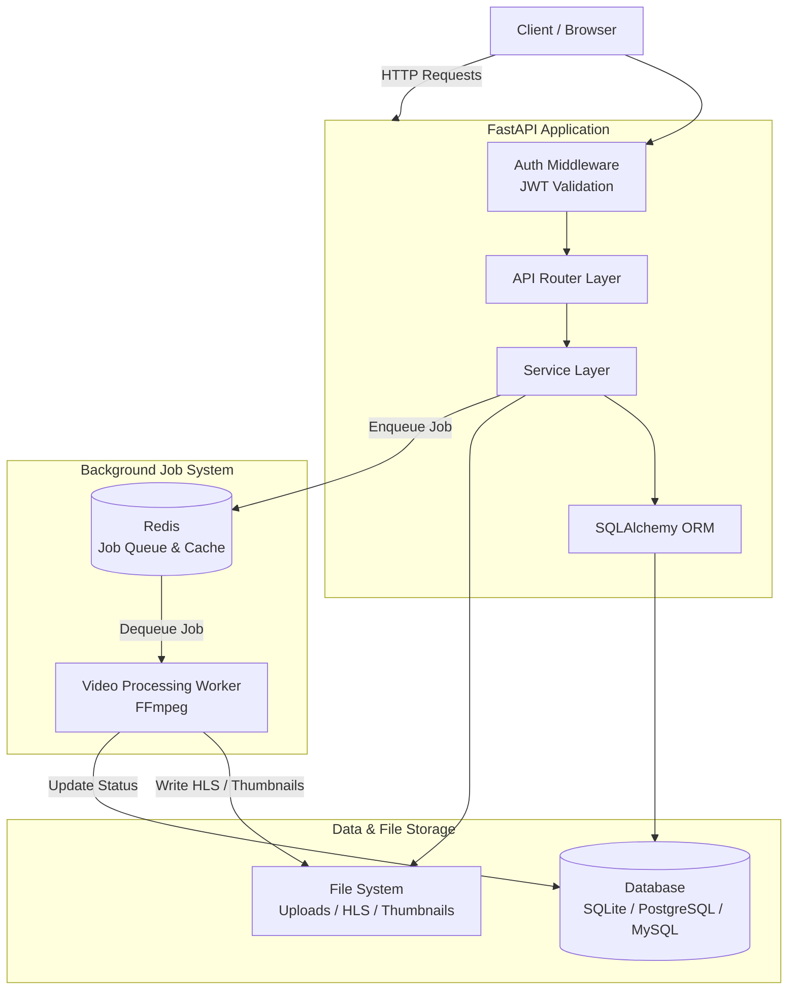

# 🚧 OnStream - Video Streaming Platform (In Development) 🚧

> ⚠️ **UNDER ACTIVE DEVELOPMENT** — This project is a work in progress. APIs, features, and architecture may change significantly before the first stable release.

[](https://www.python.org/downloads/)
[](https://fastapi.tiangolo.com/)
[](tests/)

A modern, scalable video streaming platform built with FastAPI, featuring asynchronous video processing, HLS streaming, and Redis-based job queuing.

## System Architecture



## Features

### Core Functionality

- **User Authentication**: JWT-based authentication with secure password hashing
- **Video Upload & Processing**: Asynchronous video transcoding with FFmpeg
- **HLS Streaming**: HTTP Live Streaming for adaptive bitrate video playback
- **Thumbnail Generation**: Automatic thumbnail extraction from video frames
- **Job Queue**: Redis-powered background processing for video transcoding
- **Playlists**: User-created video playlists with custom ordering
- **Analytics**: Video view tracking and analytics (optional)

### Technical Highlights

- **RESTful API**: Well-documented REST API with OpenAPI/Swagger
- **Database**: SQLAlchemy ORM (SQLite, PostgreSQL, MySQL)
- **Background Jobs**: Redis-based job queue with worker processes
- **Health Checks**: Comprehensive health monitoring endpoints
- **Standardized API Responses**: Consistent response format with request ID tracking
- **Environment-Aware Signal Handling**: Worker lifecycle management adapts to dev/production

### Reliability & Resilience

- **Connection Pooling & Retry**: Configurable Redis pool (10 connections) with exponential backoff retry (3 attempts)
- **Circuit Breaker**: Three-state pattern (CLOSED → OPEN → HALF_OPEN) prevents cascading failures
- **Job Persistence Fallback**: Database-backed queue when Redis is unavailable; jobs auto-migrate on recovery
- **Graceful Degradation**: System continues operating with reduced functionality during outages
- **Environment-Aware Signal Handling**: Ctrl+C works in development; ignored in production (managed by supervisor/systemd)

## Installation

### Prerequisites

- **Python**: 3.8 or higher
- **FFmpeg**: For video processing and thumbnail generation
- **Redis**: For job queuing (optional, defaults to local Redis instance)

### Setup

1. **Clone the repository**

   ```bash
   git clone <repository-url>
   cd onstream
   ```

2. **Create virtual environment**

   ```bash
   python -m venv venv
   source venv/bin/activate  # On Windows: venv\Scripts\activate
   ```

3. **Install dependencies**

   ```bash
   pip install -r requirements.txt
   ```

4. **Environment configuration**

   ```bash
   cp .env.example .env
   # Edit .env with your configuration
   ```

5. **Database setup**

   ```bash
   # Run database migrations
   alembic upgrade head
   ```

6. **Start Redis server** (if using Redis features)

   ```bash
   redis-server
   ```

## Running the Application

### Development Server

```bash
# Start the FastAPI server
uvicorn src.main:app --reload --host 0.0.0.0 --port 8000
```

The API will be available at: [http://localhost:8000](http://localhost:8000)

- **API Documentation**: [http://localhost:8000/docs](http://localhost:8000/docs) (Swagger UI)
- **Alternative Docs**: [http://localhost:8000/redoc](http://localhost:8000/redoc) (ReDoc)

### Background Worker

For video processing, start the worker process:

```bash
# Start video processing worker
python start_worker.py
```

For production deployment, run multiple workers:

```bash
# Terminal 1
python start_worker.py

# Terminal 2
python start_worker.py

# Terminal 3
python start_worker.py
```

## Configuration

The application uses environment variables for configuration. Copy `.env.example` to `.env` and modify as needed.

### Key Configuration Options

| Variable | Default | Description |
|----------|---------|-------------|
| `SECRET_KEY` | - | JWT signing key (required for production) |
| `ENV` | `development` | Environment mode (`development` or `production`) |
| `DATABASE_URL` | `sqlite:///./onstream.db` | Database connection string |
| `REDIS_URL` | `redis://localhost:6379/1` | Redis connection for job queue |
| `MAX_UPLOAD_SIZE` | `104857600` | Maximum video upload size (bytes) |
| `MAX_VIDEO_DURATION_SECONDS` | `3600` | Maximum video duration (seconds) |
| `VIDEO_STORAGE_BASE` | `data` | Base directory for video storage |
| `VIDEO_UPLOAD_DIR` | `uploads` | Upload subdirectory (relative to base) |
| `VIDEO_HLS_DIR` | `hls` | HLS segments subdirectory (relative to base) |
| `VIDEO_THUMBNAIL_DIR` | `thumbnails` | Thumbnails subdirectory (relative to base) |
| `LOG_LEVEL` | `INFO` | Logging level |

### Environment-Specific Path Configuration

The application automatically configures file paths based on the environment:

- **Development** (`ENV=development`): Paths resolved relative to project root (e.g., `data/uploads` → `/full/path/to/project/data/uploads`)
- **Production** (`ENV=production`): Paths treated as absolute (container-friendly, e.g., `data` → `/app/data`)

## API Response Structure

All endpoints return standardized responses with consistent format, inspired by GitHub, Stripe, and AWS APIs.

**Successful Response:**
```json
{
  "success": true,
  "data": { /* endpoint-specific data */ },
  "message": "Operation completed successfully",
  "request_id": "550e8400-e29b-41d4-a716-446655440000",
  "timestamp": "2025-11-17T13:24:03.123456Z"
}
```

**Error Response:**
```json
{
  "success": false,
  "data": null,
  "message": "Error description",
  "request_id": "550e8400-e29b-41d4-a716-446655440000",
  "timestamp": "2025-11-17T13:24:03.123456Z"
}
```

**Paginated Response:**
```json
{
  "success": true,
  "data": [ /* array of items */ ],
  "message": "Items retrieved successfully",
  "request_id": "550e8400-e29b-41d4-a716-446655440000",
  "timestamp": "2025-11-17T13:24:03.123456Z",
  "pagination": {
    "total_count": 150,
    "page": 2,
    "per_page": 10,
    "has_more": true
  }
}
```

| Field | Type | Description |
|-------|------|-------------|
| `success` | boolean | Operation success status |
| `data` | any | Response payload (null for errors) |
| `message` | string | Human-readable status message |
| `request_id` | string | Unique request identifier for tracing |
| `timestamp` | string | ISO 8601 UTC timestamp |
| `pagination` | object | Pagination metadata (list endpoints only) |

### Request ID Tracking

Every API request is assigned a unique UUID (`X-Request-ID` header + body field) for end-to-end lifecycle tracing. All log entries include the request ID for correlation across components:

```log
2025-11-17 13:24:03 - src.routers.auth - INFO - [550e8400-e29b-41d4-a716-446655440000] - User 'john' logged in successfully
2025-11-17 13:24:04 - src.routers.videos - INFO - [550e8400-e29b-41d4-a716-446655440000] - Video upload started
2025-11-17 13:24:05 - src.tasks.worker - INFO - [550e8400-e29b-41d4-a716-446655440000] - Processing video job
```

## API Endpoints

> **Note**: All endpoints except `/auth/register`, `/auth/login`, and `/health` require a Bearer token.

### Authentication

- `POST /auth/register` — Register new user
  - **Body**: `{"username", "email", "password"}`
  - **Response**: `201 Created`
- `POST /auth/login` — User login
  - **Body**: `{"username", "password"}`
  - **Response**: `200 OK` with access token

### Videos

- `POST /videos/` — Upload video (`multipart/form-data`)
  - **Body**: `file` (video), `title` (optional)
  - **Response**: `201 Created` with video object and `upload_id`
- `GET /videos/` — List user videos (paginated)
  - **Query**: `skip` (int, default 0), `limit` (int, default 100, max 100)
- `GET /videos/{upload_id}` — Get video details
- `GET /videos/{upload_id}/job` — Get processing status
- `DELETE /videos/{upload_id}` — Delete video (`204 No Content`)

### Streaming

- `GET /stream/{upload_id}/playlist.m3u8` — Get HLS playlist
- `GET /stream/{upload_id}/{segment}.ts` — Get HLS video segment

### Playlists

- `POST /playlists/` — Create playlist
  - **Body**: `{"name"}`
- `GET /playlists/` — List user's playlists (paginated)
- `GET /playlists/{playlist_id}` — Get playlist with videos
- `DELETE /playlists/{playlist_id}` — Delete playlist
- `POST /playlists/{playlist_id}/videos/{upload_id}` — Add video to playlist
  - **Body**: `{"position"}` (optional, defaults to end)
- `DELETE /playlists/{playlist_id}/videos/{upload_id}` — Remove video from playlist
- `GET /playlists/{playlist_id}/videos` — List videos in playlist with positions
- `PUT /playlists/{playlist_id}/videos/{upload_id}` — Update video position
  - **Body**: `{"position"}` (required)

### Health

- `GET /health` — Comprehensive health check (db, Redis, FFmpeg)
- `GET /health/live` — Liveness probe
- `GET /health/ready` — Readiness probe

## Testing

[](tests/)
[](tests/)

**Current Test Status**: 123 tests passed with **80.61% code coverage** (237 uncovered lines out of 1222 total)

### Run Tests

```bash
# Run all tests
pytest

# Run with coverage
pytest --cov=src --cov-report=html

# Run specific test file
pytest tests/test_videos_extended.py

# Run tests with verbose output
pytest -v
```

### Test Files

- `test_auth.py` — Authentication endpoints
- `test_crud.py` — Database operations
- `test_models.py` — Data models and schemas
- `test_videos_extended.py` — Video management (extended)
- `test_video_job.py` — Background job processing
- `test_video_worker.py` — Video processing worker
- `test_playlists_extended.py` — Playlist management
- `test_stream.py` — Video streaming endpoints
- `test_e2e.py` — End-to-end workflows

## Database Schema

### Core Tables

- **users** — User accounts and authentication
- **videos** — Video metadata and file references
- **video_jobs** — Background processing job tracking
- **playlists** — User-created video collections
- **playlist_videos** — Many-to-many playlist-video relationships
- **video_views** — Analytics and view tracking

For detailed schema documentation with ERD diagrams, see: **[docs/SCHEMA.md](docs/SCHEMA.md)**

### Migrations (Alembic)

```bash
# Create new migration
alembic revision --autogenerate -m "migration description"

# Apply migrations
alembic upgrade head

# Rollback migration
alembic downgrade -1
```

## Video Processing Pipeline

1. **Upload** — Video file uploaded via API endpoint
2. **Validation** — File type, size, and duration validation
3. **Queue** — Job added to Redis queue for processing
4. **Processing** — Worker processes video with FFmpeg:
   - HLS segment generation
   - Thumbnail extraction
   - Metadata updates
5. **Completion** — Video marked as ready for streaming

## Monitoring & Observability

### Logging

Structured logging with configurable levels and request ID correlation across all components:

- Console and file output with `[uuid]` format
- Request/response logging with unique identifiers
- Error tracking with stack traces and request context

### Health Checks

- Application status, database connectivity, Redis connectivity, background worker status

### Metrics (Optional)

Prometheus metrics support for request counts/latency, database query performance, queue processing metrics, and error rates.

## Deployment

### Production Considerations

1. **Environment Variables**: Set all required production variables
2. **Database**: Use PostgreSQL or MySQL for production
3. **Redis**: Configure Redis cluster for high availability
4. **File Storage**: Use cloud storage (S3, GCS) for scalability
5. **Reverse Proxy**: Nginx or similar for load balancing
6. **SSL/TLS**: Enable HTTPS in production
7. **Monitoring**: Set up logging and metrics collection

### Docker Deployment

```dockerfile
FROM python:3.11-slim

WORKDIR /app
COPY requirements.txt .
RUN pip install -r requirements.txt

COPY . .
RUN alembic upgrade head

EXPOSE 8000
CMD ["uvicorn", "src.main:app", "--host", "0.0.0.0", "--port", "8000"]
```

### Supervisor Configuration

For production, manage the video worker with Supervisor (`/etc/supervisor/conf.d/onstream-worker.conf`):

```ini
[program:onstream-worker]
command=/path/to/venv/bin/python /path/to/onstream/start_worker.py
directory=/path/to/onstream
user=your-user
environment=ENV=production
autostart=true
autorestart=true
redirect_stderr=true
stdout_logfile=/var/log/onstream/worker.log
stdout_logfile_maxbytes=50MB
stdout_logfile_backups=3
stopwaitsecs=30
stopsignal=TERM
```

```bash
sudo supervisorctl reread && sudo supervisorctl update
sudo supervisorctl start onstream-worker
sudo supervisorctl status onstream-worker
```

## License

Pending.

## Acknowledgments

- [FastAPI](https://fastapi.tiangolo.com/) — Modern Python web framework
- [SQLAlchemy](https://sqlalchemy.org/) — Python SQL toolkit
- [FFmpeg](https://ffmpeg.org/) — Multimedia processing
- [Redis](https://redis.io/) — In-memory data structure store