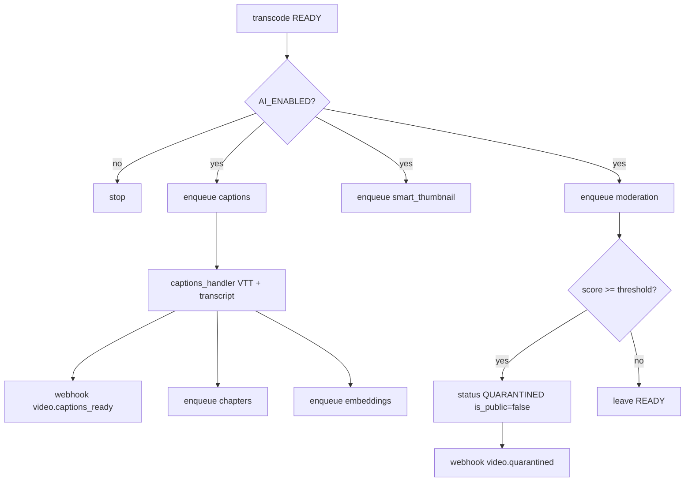

# AI media intelligence — system design

Index: [`README.md`](README.md).

OnStream can attach optional intelligence jobs after a successful VOD transcode: captions, chapters, moderation, embeddings, and smart thumbnails. The feature set is **disabled by default** (`AI_ENABLED=false`) so continuous integration and laptop development remain lightweight and GPU-free.

AI work reuses the same Redis dispatch map as media encoding (`job_type` handlers in `src/worker/runner.py`). There is no separate broker. See [`REDIS_QUEUE.md`](REDIS_QUEUE.md) for transport details and [`MEDIA_CORE.md`](MEDIA_CORE.md) for where AI is enqueued after `READY`.

## Enabling AI

Providers resolve through `src/infrastructure/ai/registry.py` (see [`PROVIDERS.md`](PROVIDERS.md)). Configure names and thresholds in `.env` or Compose:

```bash
AI_ENABLED=true
AI_CAPTIONS_PROVIDER=mock          # or faster_whisper
AI_EMBEDDINGS_PROVIDER=mock        # or sentence_transformers
AI_MODERATION_THRESHOLD=0.7
```

Per-feature flags are consulted only when `AI_ENABLED=true`:

| Flag | Default intent |
|------|----------------|
| `AI_CAPTIONS_ENABLED` | Whisper / mock → VTT + transcript |
| `AI_CHAPTERS_ENABLED` | After captions |
| `AI_MODERATION_ENABLED` | Parallel after transcode |
| `AI_EMBEDDINGS_ENABLED` | After captions → `video_embeddings` |
| `AI_SMART_THUMBNAIL_ENABLED` | Parallel after transcode |

Install optional packages and run the dedicated profile when you want heavy dependencies isolated from the default worker image:

```bash
pip install -r requirements-ai.txt
docker compose --profile ai up worker-ai
```

## Job graph

Transcode remains the critical path. When AI is enabled, moderation and smart thumbnail run in parallel with captions. Captions unlock chapters and embeddings because those stages consume transcript text. Moderation may move a `READY` video into `QUARANTINED` without rolling back the HLS tree; playback then becomes owner-only until review.



Queue payloads are JSON `{"upload_id","job_type"}` on `video_jobs_queue`.

## Data written on `videos`

Handlers persist artifacts as paths and JSON on the `videos` row (and embedding rows), so playback and search APIs do not need a second metadata store.

| Field | Producer |
|-------|----------|
| `caption_vtt_path`, `transcript_path`, `detected_language` | captions |
| `chapters_json`, `suggested_title`, `suggested_tags` | chapters |
| `moderation_score`, `moderation_labels`, `quarantined_at` | moderation |
| `preview_clip_path` / smart thumb paths | smart_thumbnail |
| rows in `video_embeddings` | embeddings |

Playback behavior: quarantined assets are playable by the **owner only**. When `caption_vtt_path` is set, master playlists inject `#EXT-X-MEDIA:TYPE=SUBTITLES` so compatible players can load captions.

## HTTP surface

| Method | Path | Role |
|--------|------|------|
| GET | `/v1/moderation/queue` | Quarantined items for current user |
| POST | `/v1/moderation/{video_id}/review` | `approve` \| `reject` (+ optional `make_public`) |
| GET | `/v1/search/capabilities` | `semantic_available`, `provider`, `indexed_videos` |
| GET | `/v1/search/?q=&mode=keyword\|semantic` | Keyword or embedding search (incompatible dims skipped) |
| GET | `/v1/videos/{video_id}/chapters` | Chapter JSON |

## Providers

| Setting | `mock` | Real |
|---------|--------|------|
| `AI_CAPTIONS_PROVIDER` | Deterministic fake VTT | `faster_whisper` |
| `AI_EMBEDDINGS_PROVIDER` | Fake vectors | `sentence_transformers` |

Mock providers exist so pytest and CI never require Whisper weights or embedding model downloads.

## Design constraints

- AI enqueue happens after media is `READY`; captions and related jobs do not delay the first playable ABR tree.
- Moderation may quarantine afterward; that is an access-policy change, not a re-encode.
- The default worker can run AI handlers; the `ai` Compose profile isolates heavy Python dependencies.
- AI jobs share the custom Redis queue (same worker dispatch as transcode).
