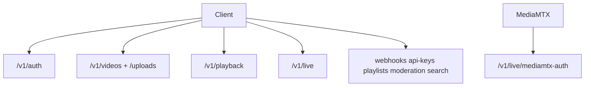

# API reference map (`/v1`)

Index: [`README.md`](README.md).

This document is the route catalogue for OnStream’s public HTTP surface. Interactive exploration is available on the running server at:

| UI | URL |
|----|-----|
| Scalar API reference | [`/scalar`](http://localhost:8000/scalar) (recommended) |
| Swagger UI | [`/docs`](http://localhost:8000/docs) |
| ReDoc | [`/redoc`](http://localhost:8000/redoc) |

Architectural context lives in [`FOUNDATION.md`](FOUNDATION.md); behavioral detail for media and live flows lives in the sibling design documents.

Unless noted, JSON **success** responses use `{ success, data, message, request_id, timestamp, api_version }`. List endpoints may add `pagination`. Authenticate with `Authorization: Bearer <access_token>` or, where supported, `X-API-Key: <key>`.

## Error envelope (breaking)

All `/v1` errors (except MediaMTX auth webhook, which returns bare status) use:

```json
{
  "success": false,
  "error": {
    "code": "AUTH_INVALID_CREDENTIALS",
    "message": "Incorrect username or password",
    "details": null
  },
  "request_id": "...",
  "timestamp": "...",
  "api_version": "v1"
}
```

`422` validation failures set `error.code` to `VALIDATION_FAILED` and populate `details` with `{field, message, code}` entries. There is no FastAPI `detail` key.

### Error code catalogue

| Code | HTTP | Meaning |
|------|------|---------|
| `AUTH_USERNAME_TAKEN` | 400 | Register username conflict |
| `AUTH_EMAIL_TAKEN` | 400 | Register email conflict |
| `AUTH_INVALID_CREDENTIALS` | 401 | Bad login |
| `AUTH_INVALID_TOKEN` | 401/400 | Refresh or password-reset token |
| `AUTH_UNAUTHORIZED` | 401 | Missing/invalid access credentials |
| `VIDEO_NOT_FOUND` | 404 | Video missing |
| `VIDEO_FORBIDDEN` | 403 | Not owner / no access |
| `VIDEO_BAD_REQUEST` | 400 | Invalid validation |
| `VIDEO_TOO_LARGE` | 413 | Upload size |
| `VIDEO_INVALID_FILE` | 400 | Corrupt / unreadable media |
| `UPLOAD_SESSION_NOT_FOUND` | 404 | Direct upload session |
| `UPLOAD_SESSION_GONE` | 410 | Session expired |
| `UPLOAD_BAD_REQUEST` | 400 | Empty/invalid chunk |
| `UPLOAD_TOO_LARGE` | 413 | Chunk exceeds limit |
| `UPLOAD_OBJECT_MISSING` | 400 | Object not in storage |
| `PLAYBACK_NOT_READY` | 409 | ABR not ready |
| `PLAYBACK_FORBIDDEN` | 403 | Playback denied |
| `PLAYBACK_UNAUTHORIZED` | 401 | Missing stream token |
| `PLAYBACK_NOT_FOUND` | 404 | Playlist/segment missing |
| `PLAYBACK_BAD_REQUEST` | 400 | Bad segment name |
| `LIVE_DISABLED` | 403 | Live feature off |
| `LIVE_NOT_FOUND` | 404 | Stream missing |
| `LIVE_FORBIDDEN` | 403 | Live access denied |
| `LIVE_UNAUTHORIZED` | 401 | Live playback auth |
| `JOB_NOT_FOUND` | 404 | Job missing |
| `JOB_CONFLICT` | 409 | Retry/cancel not allowed |
| `JOB_BAD_REQUEST` | 400 | Unknown job action/type |
| `JOB_FAILED` | 500 | Worker processing failure |
| `PLAYLIST_NOT_FOUND` | 404 | Playlist missing |
| `PLAYLIST_FORBIDDEN` | 403 | Playlist access |
| `PLAYLIST_CONFLICT` | 409/400 | Name taken / state conflict |
| `PLAYLIST_BAD_REQUEST` | 400 | Playlist params |
| `WEBHOOK_NOT_FOUND` | 404 | Webhook missing |
| `API_KEY_NOT_FOUND` | 404 | API key missing |
| `SEARCH_BAD_REQUEST` | 400 | Search params |
| `MODERATION_CONFLICT` | 409 | Not quarantined |
| `MODERATION_BAD_REQUEST` | 400 | Moderation input |
| `MODERATION_FORBIDDEN` | 403 | Moderation access |
| `CAPTION_NOT_FOUND` | 404 | Caption asset |
| `CAPTION_FORBIDDEN` | 403 | Caption access |
| `VALIDATION_FAILED` | 422 | Request body/schema |
| `VALIDATION_INVALID_ID` | 400 | Public id format |
| `VALIDATION_BAD_REQUEST` | 400 | Generic validation |
| `RATE_LIMIT_EXCEEDED` | 429 | Auth rate limit |
| `INTERNAL_SERVER_ERROR` | 500 | Unhandled / generic server |
| `INTERNAL_STORAGE_FAILURE` | 500 | Object storage I/O |
| `INTERNAL_QUEUE_FAILURE` | 500 | Queue bookkeeping |

Job rows (`video_jobs` / `queued_jobs`) and `video.failed` webhooks also carry `error_code` when a worker fails.

Prometheus counter `onstream_api_errors_total{code,http_status}` increments on every structured error response.

When enqueue fails after Redis **and** DB fallback (`INTERNAL_QUEUE_FAILURE`), the video/job are marked `ERROR` so clients can retry via the jobs API.



## Auth — `/v1/auth`

Registration and login establish control-plane credentials. Login uses OAuth2 password form encoding for compatibility with OpenAPI password flows; other auth routes accept JSON.

| Method | Path | Notes |
|--------|------|--------|
| POST | `/register` | JSON username, email, password |
| POST | `/login` | **form-urlencoded** username/password |
| POST | `/token/refresh` | JSON refresh_token |
| POST | `/password-reset` | JSON email |
| POST | `/password-reset/confirm` | token + new password |

## Videos — `/v1/videos`

Video identifiers in paths are public `upload_id` values. Multipart create is the convenience upload; prefer `/v1/uploads` for large or resumable transfers ([`MEDIA_CORE.md`](MEDIA_CORE.md)). Responses include `source` (`upload` or `live`) and `live_stream_id` when the row was archived from a live stream.

| Method | Path |
|--------|------|
| GET | `/` list |
| POST | `/` multipart upload |
| GET | `/{video_id}` |
| PATCH | `/{video_id}` title, description, `visibility` (`private` \| `unlisted` \| `public`) or legacy `is_public` |
| DELETE | `/{video_id}` |
| POST | `/{video_id}/tokens` signed playback; optional `clip_start` / `clip_end` |
| GET | `/{video_id}/job` (jobs router) |
| GET | `/{video_id}/chapters` |
| GET | `/continue` continue-watching shelf |
| DELETE | `/continue` dismiss all from Continue (history kept) |
| DELETE | `/{video_id}/continue` dismiss one from Continue (history kept) |
| GET | `/history` watch history |
| DELETE | `/history` clear all watch progress |
| GET | `/saved` favorited videos |
| DELETE | `/saved` clear all favorites |
| POST | `/{video_id}/progress` upsert resume position |
| GET | `/{video_id}/progress` |
| DELETE | `/{video_id}/progress` clear resume for one video (removes from history too) |
| PUT | `/{video_id}/favorite` |
| DELETE | `/{video_id}/favorite` |

## Share links — `/v1/share-links`

DB-backed expiring watch links. Create returns plaintext token once; exchange (public) mints a short stream JWT.

| Method | Path |
|--------|------|
| POST | `/` create (auth); optional `clip_start` / `clip_end` |
| GET | `/?video_id=` list (auth) |
| DELETE | `/{public_id}` revoke (auth) |
| POST | `/{public_id}/exchange` body `{ token }` (public); returns clip bounds + storyboard/caption URLs |

Browser landing: `/demo/watch/?s={public_id}&t={token}`. Add `embed=1` for iframe chrome, `playlist={id}` for a public playlist side panel. Create also returns `app_url` (`onstream://watch?s=…&t=…`) for the Expo demo.

**Visibility.** `private` needs a token or owner JWT. `unlisted` and `public` play without a token when `READY`. Only `public` appears in RSS.

## Feeds — `/v1/feeds` (public)

| Method | Path |
|--------|------|
| GET | `/{username}/videos.rss` public READY videos |
| GET | `/{username}/playlists/{playlist_id}.rss` public playlist (public videos only) |

## Playlists — `/v1/playlists`

| Method | Path |
|--------|------|
| POST | `/` create (`name`, optional `is_public`) |
| GET | `/` list (auth). `?contains_video={upload_id}` adds `contains_video` per row |
| GET | `/public/{playlist_id}` public playlist + public videos (no auth) |
| GET | `/{playlist_id}` |
| PATCH | `/{playlist_id}` `name` / `is_public` |
| DELETE | `/{playlist_id}` |
| GET | `/{playlist_id}/videos` |
| POST / PUT / DELETE | `/{playlist_id}/videos/{video_id}` |

## Uploads — `/v1/uploads`

Direct upload separates session creation, byte transfer, and completion so clients can retry `PUT`s without re-creating metadata.

| Method | Path |
|--------|------|
| POST | `/` create session |
| PUT | `/{session_id}` body bytes |
| POST | `/{session_id}/complete` |

## Playback

Playback routes serve HLS masters and assets for VOD and live. Authorization accepts a stream token query parameter, a Bearer token, or public/unlisted visibility. Stream JWTs may include `clip_start` / `clip_end`; the master playlist injects `#EXT-X-START` when `clip_start` is present. Storyboard sprites live at `/v1/playback/{id}/storyboard.jpg` and `.vtt`. Live `POST /v1/playback/live/{stream_id}/whep` is the viewer WHEP gateway (SDP in/out, opaque session `Location`); it does not expose the encoder stream key. `POST /v1/live/{id}/tokens` returns `playback_url` (HLS) and `whep_playback_url` (signaling).

| Method | Path |
|--------|------|
| GET | `/v1/playback/{video_id}/master.m3u8` |
| GET | `/v1/playback/{video_id}/{asset}` |
| GET | `/v1/playback/live/{stream_id}/master.m3u8` |
| GET | `/v1/playback/live/{stream_id}/{asset}` |
| POST | `/v1/playback/live/{stream_id}/whep` SDP offer (tokenized WHEP signaling) |
| DELETE | `/v1/playback/live/{stream_id}/whep/sessions/{session_id}` |

## Live — `/v1/live`

Create returns sensitive publish material once (`stream_key`, `whip_url`, `whep_url`). MediaMTX calls `/mediamtx-auth` on publish and read. Operational recipes: [`PLAYBACK_CLIENTS.md`](PLAYBACK_CLIENTS.md). GET/DELETE include `archived_upload_id` and `archive_playback_url` after a successful live → VOD promote.

| Method | Path |
|--------|------|
| POST | `/` create (returns stream_key, whip_url, whep_url once) |
| GET | `/` list (`include_ended=true` includes revoked rows) |
| GET | `/{stream_id}` |
| GET | `/{stream_id}/health` |
| DELETE | `/{stream_id}` revoke (archives VOD when `LIVE_ARCHIVE_ENABLED`) |
| POST | `/{stream_id}/tokens` |
| POST | `/mediamtx-auth` MediaMTX webhook |

### Live outbound webhooks

Register endpoints under `/v1/webhooks` (HMAC via `X-OnStream-Signature`). Live events:

| Event | When |
|-------|------|
| `live.created` | Stream row created (`POST /v1/live`) |
| `live.started` | First successful publish auth (idle → live); not re-emitted while already live |
| `live.idle` | Unpublish auth, or health soft-fail (missing/stale playlist) |
| `live.ended` | Explicit revoke (`DELETE /v1/live/{id}`) only; `data.archived_upload_id` when a VOD replay was saved |

Payload shape: `{ "type", "created_at", "data": { stream_id, user_id, title, status, …, reason? } }`. Subscribe with those names or `*`. Worker delivers pending rows on its webhook tick.

| Method | Path | Notes |
|--------|------|--------|
| POST | `/v1/webhooks/` | Create endpoint (secret returned once) |
| GET | `/v1/webhooks/` | List endpoints |
| GET | `/v1/webhooks/deliveries` | Recent delivery inbox for the caller (`?limit=`) |
| DELETE | `/v1/webhooks/{id}` | Remove endpoint |

## Other `/v1` routers

| Prefix | Purpose |
|--------|---------|
| `/webhooks` | endpoint CRUD + deliveries |
| `/api-keys` | API key management |
| `/playlists` | user playlists + public GET |
| `/feeds` | public RSS (user library / playlist) |
| `/moderation` | quarantine queue + review |
| `/search` | keyword (Postgres FTS + rank; ILIKE fallback) / semantic |

## Non-`/v1` operational endpoints

These routes are mounted on the application root for probes, metrics scrapers, and the optional demo player.

| Path | Purpose |
|------|---------|
| `/health` | deep health |
| `/health/live` | liveness |
| `/health/ready` | readiness |
| `/metrics` | Prometheus (if enabled) |
| `/scalar` | Scalar interactive API reference |
| `/demo/` | static hls.js (if `DEMO_PLAYER_ENABLED`) |
| `/demo/watch/` | anonymous share-link landing (`?s=` + `?t=`; `embed=1`, `playlist=`) |

## Client guides

[`PLAYBACK_CLIENTS.md`](PLAYBACK_CLIENTS.md) · [`onstream-demo/README.md`](../onstream-demo/README.md)
