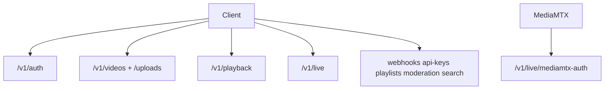

# API reference map (`/v1`)

Index: [`README.md`](README.md).

This document is the route catalogue for OnStream’s public HTTP surface. Interactive schemas, examples, and try-it forms are available from the running server at `/docs` (OpenAPI / Swagger). Architectural context lives in [`FOUNDATION.md`](FOUNDATION.md); behavioral detail for media and live flows lives in the sibling design documents.

Unless noted, JSON responses use the standard envelope `{ success, data, message, request_id, timestamp, api_version }`. List endpoints may add `pagination`. Authenticate with `Authorization: Bearer <access_token>` or, where supported, `X-API-Key: <key>`.

## Auth — `/v1/auth`

Registration and login establish control-plane credentials. Login uses OAuth2 password form encoding for compatibility with OpenAPI password flows; other auth routes accept JSON.

| Method | Path | Notes |
|--------|------|--------|
| POST | `/register` | JSON username, email, password |
| POST | `/login` | **form-urlencoded** username/password |
| POST | `/token/refresh` | JSON refresh_token |
| POST | `/password-reset` | JSON email |
| POST | `/password-reset/confirm` | token + new password |

## Videos — `/v1/videos`

Video identifiers in paths are public `upload_id` values. Multipart create is the convenience upload; prefer `/v1/uploads` for large or resumable transfers ([`MEDIA_CORE.md`](MEDIA_CORE.md)).

| Method | Path |
|--------|------|
| GET | `/` list |
| POST | `/` multipart upload |
| GET | `/{video_id}` |
| PATCH | `/{video_id}` |
| DELETE | `/{video_id}` |
| POST | `/{video_id}/tokens` signed playback |
| GET | `/{video_id}/job` (jobs router) |
| GET | `/{video_id}/chapters` |

## Uploads — `/v1/uploads`

Direct upload separates session creation, byte transfer, and completion so clients can retry `PUT`s without re-creating metadata.

| Method | Path |
|--------|------|
| POST | `/` create session |
| PUT | `/{session_id}` body bytes |
| POST | `/{session_id}/complete` |

## Playback

Playback routes serve HLS masters and assets for VOD and live. Authorization accepts a stream token query parameter, a Bearer token, or public visibility. Playlist responses rewrite child URLs so tokens propagate to segments.

| Method | Path |
|--------|------|
| GET | `/v1/playback/{video_id}/master.m3u8` |
| GET | `/v1/playback/{video_id}/{asset}` |
| GET | `/v1/playback/live/{stream_id}/master.m3u8` |
| GET | `/v1/playback/live/{stream_id}/{asset}` |

## Live — `/v1/live`

Create returns sensitive publish material once (`stream_key`, `whip_url`, `whep_url`). MediaMTX calls `/mediamtx-auth` on publish and read. Operational recipes: [`PLAYBACK_CLIENTS.md`](PLAYBACK_CLIENTS.md).

| Method | Path |
|--------|------|
| POST | `/` create (returns stream_key, whip_url, whep_url once) |
| GET | `/` list |
| GET | `/{stream_id}` |
| GET | `/{stream_id}/health` |
| DELETE | `/{stream_id}` |
| POST | `/{stream_id}/tokens` |
| POST | `/mediamtx-auth` MediaMTX webhook |

## Other `/v1` routers

| Prefix | Purpose |
|--------|---------|
| `/webhooks` | endpoint CRUD + deliveries |
| `/api-keys` | API key management |
| `/playlists` | user playlists |
| `/moderation` | quarantine queue + review |
| `/search` | keyword / semantic search |

## Non-`/v1` operational endpoints

These routes are mounted on the application root for probes, metrics scrapers, and the optional demo player.

| Path | Purpose |
|------|---------|
| `/health` | deep health |
| `/health/live` | liveness |
| `/health/ready` | readiness |
| `/metrics` | Prometheus (if enabled) |
| `/demo/` | static hls.js (if `DEMO_PLAYER_ENABLED`) |

## Client guides

[`PLAYBACK_CLIENTS.md`](PLAYBACK_CLIENTS.md) · [`onstream-demo/README.md`](../onstream-demo/README.md)
