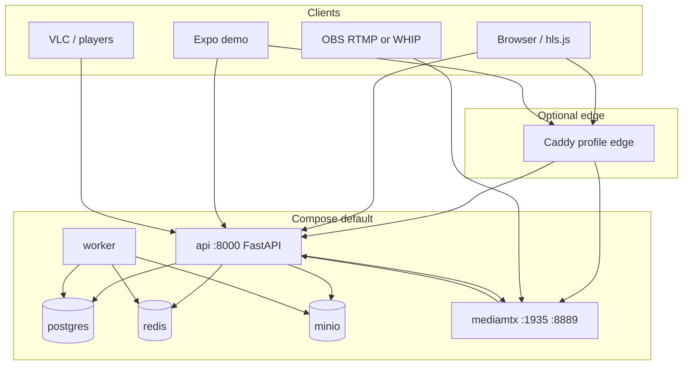
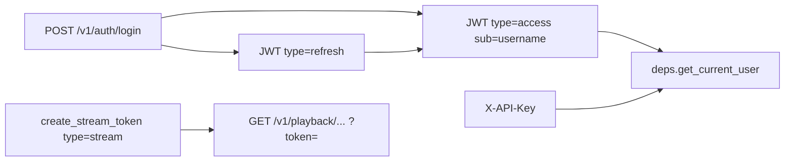

# Platform foundation — system design

Index: [`README.md`](README.md).

OnStream is a **self-hosted Mux-ish media engine**: HTTP API + async workers + object/file storage + MediaMTX for live. This document explains how the platform is put together; VOD/live/queue details live in sibling docs.

Think of OnStream as an **engine**, not a website: callers (your app, Expo demo, OBS, VLC) speak HTTP to `/v1`, long work happens off-request in workers, and bytes live on a storage backend the API and worker both understand. Live is deliberately split — MediaMTX owns realtime ingest; OnStream owns identity, auth, playback URLs, and kicking publishers when you revoke a stream.

## Package layout

The layout exists so HTTP stays thin and business rules stay testable. Routers should not open FFmpeg or talk Redis directly; application services orchestrate, infrastructure adapters do I/O. That split is why you can swap local disk for MinIO, or add a GPU worker image, without rewriting route handlers.

```text
src/
├── main.py                 # FastAPI app, middleware, /metrics, /demo
├── api/v1/                 # HTTP routers only (thin)
│   ├── router.py
│   ├── deps.py             # Bearer JWT + X-API-Key → user
│   └── routes/             # auth, videos, uploads, playback, live, …
├── application/            # Use-cases / domain services
├── schemas/                # Pydantic request/response models
├── core/                   # config, logger (structlog), metrics, otel, security
├── infrastructure/
│   ├── db/                 # SQLAlchemy models + repositories
│   ├── storage/            # local | s3 (MinIO)
│   ├── queue/              # Redis job queue + circuit breaker
│   ├── media/              # FFmpeg ABR, PyAV helpers, quality gate
│   ├── live/               # MediaMTX client, health, QoE, live ABR
│   ├── cdn/                # Cloudflare / Bunny / noop purge
│   └── webhooks/           # HMAC outbound deliveries
└── worker/                 # runner + typed handlers
```

**Rule:** routes call application services; services call repositories / infrastructure. Alembic owns schema — API startup does **not** `create_all`.

## Runtime topology

In the default Compose stack, **five kinds of process** cooperate. The API answers quickly and enqueues work. The worker is the only place that should burn CPU on encode (and optional AI). Postgres is the system of record. Redis is a *fast path* for jobs, not the source of truth. MediaMTX is a specialized media server OnStream trusts via an HTTP auth webhook and a shared live HLS volume.

You can hit the API directly on `:8000` for LAN demos. The optional Caddy (`edge`) profile terminates **lab TLS** (mkcert) or production TLS and reverse-proxies API + WHIP/WHEP **signaling**. ICE/RTP stays on MediaMTX UDP `:8189` — Caddy cannot proxy media.



| Service | Role |
|---------|------|
| `api` | `/v1/*`, MediaMTX auth webhook, playback, health, Prometheus |
| `worker` | Dequeue jobs, transcode/AI handlers, live health + QoE ticks |
| `postgres` | Source of truth for users, videos, jobs, live, webhooks |
| `redis` | `video_jobs_queue` list (`LPUSH` / `BLPOP`) |
| `minio` | Optional object store when `STORAGE_BACKEND=minio` or `s3` |
| `mediamtx` | Live ingest (RTMP/WHIP) + remux HLS into shared `live_data` volume |

Profiles keep the **happy path small**. A laptop `docker compose up` should not pull CUDA, Whisper weights, or coturn unless you ask. Each profile adds capacity for a real deployment concern (AI weight, GPU encode, NAT, TLS, dashboards) without forking the product into multiple repos.

### Compose profiles

| Profile | Adds | Why |
|---------|------|-----|
| `ai` | `worker-ai` | heavier AI deps (`requirements-ai.txt`) |
| `gpu` | `worker-gpu` | `FFMPEG_HWACCEL=nvenc` |
| `turn` | coturn (+ overlay) | ICE for internet WebRTC |
| `edge` | Caddy | TLS terminator (mkcert lab / Let’s Encrypt prod). WHIP signaling only. |
| `obs` | Prometheus + Grafana | scrape `/metrics` |

## Auth model

OnStream separates **control-plane auth** (who may call `/v1/videos`, `/v1/live`, …) from **playback auth** (who may fetch an `.m3u8` / `.ts`). Mixing those into one long-lived user JWT on every segment request would either over-share credentials with CDN edges or force players to send full session cookies. Instead, login issues short-lived access/refresh JWTs for the API; when you want someone (or VLC) to play a private asset, you mint a **stream token** whose `sub` is the video or live id and whose `type` is `stream`. Playlists rewrite child URLs so the token rides along without the player implementing custom headers.

API keys (`X-API-Key`) exist for machine-to-machine control-plane calls (CI, backends) without pretending to be a browser user session. Scopes (`read`, `upload`, `write`, `webhooks`) are enforced; key administration is JWT-only so a key cannot mint more keys. `last_used_at` is throttled to once per minute.

Errors use the same envelope shape as successes (`success: false`) with a nested `error.code` in SCREAMING_SNAKE form — see [`API.md`](API.md). There is no FastAPI `{detail}` body on `/v1`.



| Token | `type` claim | `sub` | Purpose |
|-------|--------------|-------|---------|
| Access | `access` | username | All authenticated `/v1` APIs |
| Refresh | `refresh` | username | Rotate access |
| Password reset | `password_reset` | email | Reset flow |
| Stream / playback | `stream` | `upload_id` or `stream_id` | HLS playlist/segment auth |

Implementation: `src/core/security/tokens.py`. Playback also accepts the **owner’s access JWT** or `is_public=true` (`playback_service` / live authorize helpers).

## Storage design

Storage is abstracted behind a provider registry so the same application code can run against local directories or S3-compatible buckets (MinIO in Compose, Cloudflare R2, or AWS). `get_storage()` in `src/infrastructure/storage/factory.py` resolves `STORAGE_BACKEND` via `registry.py` (`local` | `s3` | `minio` | `r2`). Operator detail and R2 credentials live in [`PROVIDERS.md`](PROVIDERS.md).

Object keys and `hls_path` values stored in the database are project-relative strings (`src/utils/paths.py`). That keeps Docker (`/app/data/...`) and local virtualenv checkouts interchangeable without rewriting rows when the absolute prefix changes.

```text
data/
├── uploads/{upload_id}_{session_id}.mp4
├── hls/{upload_id}/master.m3u8
│                 /{height}p/index.m3u8 + segment_*.ts
├── thumbnails/{video_db_id}.jpg
├── live/live/{stream_key}/…          # MediaMTX remux (volume shared)
│    └── {stream_id}/index.m3u8       # FFmpeg normalize (WHIP)
│    └── {stream_id}/abr/…            # optional live ABR
└── cache/…                           # S3 download cache when backend≠local
```

| Setting | Default | Meaning |
|---------|---------|---------|
| `STORAGE_BACKEND` | `local` | `local` \| `s3` \| `minio` \| `r2` |
| `S3_ADDRESSING_STYLE` | (backend default) | `path` \| `virtual` |
| `PUBLIC_PLAYBACK_BASE_URL` | (→ API base) | Edge host used when building CDN purge URLs |
| `VIDEO_UPLOAD_DIR` | `data/uploads` | ingest objects |
| `VIDEO_HLS_DIR` | `data/hls` | VOD ABR output |
| `VIDEO_THUMBNAIL_DIR` | `data/thumbnails` | posters |
| `LIVE_HLS_DIR` | `data/live` | live playlists (API + MediaMTX) |

Compose mounts: `media_data` → `/app/data`; `live_data` → `/app/data/live` and MediaMTX `/hls`. The shared live volume is required so MediaMTX can write remuxed HLS and the API can authorize and serve it without a second copy pipeline.

## Live control plane (future seam)

Kick, publish auth, and path health today call MediaMTX HTTP APIs and the OnStream auth webhook directly (`live_service.py`, `mediamtx_client.py`). A future `LiveControlPlane` protocol would isolate:

| Method | Responsibility |
|--------|----------------|
| `authorize_publish` | Validate stream key / path before ingest |
| `kick_publisher` | Drop an active publisher on revoke/delete |
| `path_state` / health inputs | Ready signals for live health ticks |

**Sole implementation now:** MediaMTX. nginx-rtmp and alternate SFUs are explicit non-goals until a second product backend is required. See [`PLAYBACK_CLIENTS.md`](PLAYBACK_CLIENTS.md) and [`PROVIDERS.md`](PROVIDERS.md).

## Observability hooks (foundation)

Foundation wiring exposes three complementary signals: structured logs for forensic grep, Prometheus metrics for dashboards and alerts, and optional OpenTelemetry export for distributed traces. Deeper metric names and live-specific gauges are catalogued in [`OPS_MEDIA.md`](OPS_MEDIA.md).

| Layer | Module | Behavior |
|-------|--------|----------|
| Logs | `src/core/logger.py` | structlog; bind `request_id`, `upload_id`, `stream_id`, `job_type`, `user_id` |
| HTTP metrics | `src/core/metrics.py` | `onstream_http_*` via middleware when `PROMETHEUS_ENABLED` |
| Tracing | `src/core/otel.py` | OTLP when `OTEL_ENABLED` (+ optional endpoint) |
| Errors | Sentry | when `SENTRY_DSN` set |

## Database

Relational state (users, videos, jobs, live streams, webhooks) lives behind SQLAlchemy. Use SQLite for quick local experiments and Postgres in Compose or production via `DATABASE_URL`. Apply schema with `alembic upgrade head`. Entity relationships and status machines are documented in [`SCHEMA.md`](SCHEMA.md).

## Product boundaries

**In scope:** engine APIs, VOD ABR, live MediaMTX integration, the custom job queue, and optional AI, CDN purge, and GPU encode profiles.

**Out of scope:** Celery, Dramatiq, or Arq; social organizations, channels, or feeds; replacing MediaMTX with nginx-rtmp.
## Related design docs

| Doc | Depth |
|-----|--------|
| [`MEDIA_CORE.md`](MEDIA_CORE.md) | VOD upload → ABR → signed playback |
| [`REDIS_QUEUE.md`](REDIS_QUEUE.md) | Queue, circuit breaker, DB fallback, dispatch |
| [`PLAYBACK_CLIENTS.md`](PLAYBACK_CLIENTS.md) | Live + client recipes |
| [`OPS_MEDIA.md`](OPS_MEDIA.md) | CDN, NVENC, VMAF, Grafana |
| [`PROVIDERS.md`](PROVIDERS.md) | Storage / AI / email / CDN registries |
| [`AI_MEDIA.md`](AI_MEDIA.md) | Post-transcode AI graph |
| [`API.md`](API.md) | Route catalogue |
