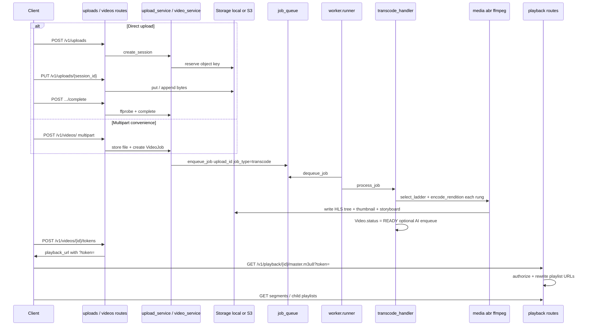
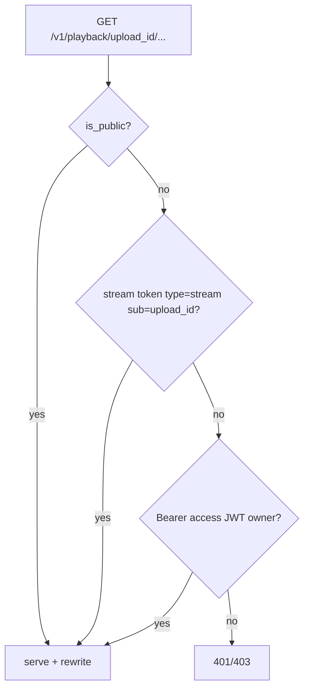

# Media core — VOD system design

Index: [`README.md`](README.md).

This document describes the on-demand (VOD) pipeline: how uploaded media becomes adaptive HLS, how clients obtain access, and which components own each stage. Live ingest is documented in [`PLAYBACK_CLIENTS.md`](PLAYBACK_CLIENTS.md). Queue reliability is documented in [`REDIS_QUEUE.md`](REDIS_QUEUE.md).

The design goal is a Mux-like control plane: the upload API returns quickly, encoding runs asynchronously, and playback is a separate authorized fetch of playlists and segments. Public identifiers exposed to clients are always `upload_id` values, never internal database primary keys.

## End-to-end sequence

The diagram below is the canonical happy path. Direct upload is preferred for large files because it separates session creation, byte transfer, and completion. Multipart `POST /v1/videos/` remains available for small demos and simple clients. In both cases, completion (or multipart accept) enqueues a `transcode` job; only the worker writes the ABR tree.



## Upload paths

Upload creates durable metadata before heavy processing. A `Video` row, an optional `UploadSession`, and a `VideoJob` progress row are established so clients can poll status even if Redis is temporarily unavailable (see database fallback in [`REDIS_QUEUE.md`](REDIS_QUEUE.md)).

### Direct upload (preferred for large / resumable)

Use this path when the client can stream bytes in one or more `PUT`s, optionally with `Content-Range`. Completion runs a duration probe, finalizes the session, and enqueues transcode.

| Step | Route | Service |
|------|-------|---------|
| Create | `POST /v1/uploads/` | `upload_service.create_session` → `Video` + `UploadSession` + `VideoJob` |
| Body | `PUT /v1/uploads/{session_id}` | `append_content` / `put_bytes` (optional `Content-Range`) |
| Finish | `POST /v1/uploads/{session_id}/complete` | duration probe, mark ready for queue, `enqueue_job` |

Clients may send an `Idempotency-Key` header on create so retries do not allocate duplicate sessions (`idempotency_records`).

Object key pattern: `data/uploads/{upload_id}_{session_id}.mp4`.

### Multipart

`POST /v1/videos/` with form fields `file`, `title`, and `description` stores the file in one request and enqueues the same `transcode` job. Suitable for tooling and the Expo demo; less ideal for multi-gigabyte sources.

Public id everywhere else is **`upload_id`** (8–12 safe alphanumeric characters), not the integer primary key.

## Transcode pipeline

Entry point: `src/worker/handlers/transcode_handler.py` → `process_video`.

The worker selects a bitrate ladder from source height, encodes each rung (optionally via NVENC with libx264 fallback), writes a master playlist, then produces poster and storyboard artifacts. An optional quality gate may score the top rung against the source. Only after the media tree is durable does the video become `READY`. If AI is enabled, follow-on jobs are enqueued without blocking that READY transition (moderation may later quarantine).

```mermaid
flowchart TD
  A[dequeue transcode] --> B[load Video + open source]
  B --> C[select_ladder from source height]
  C --> D{For each rung}
  D --> E[encode_rendition]
  E --> F{FFMPEG_HWACCEL=nvenc?}
  F -->|yes| G[h264_nvenc then fallback libx264]
  F -->|no| H[libx264]
  G --> I[write {height}p/index.m3u8 + .ts]
  H --> I
  I --> D
  D --> J[write_master_playlist]
  J --> K[thumbnail + storyboard]
  K --> L{QUALITY_GATE_ENABLED?}
  L -->|yes| M[VMAF or PSNR vs source]
  M --> N[store quality_score webhook video.quality]
  L -->|no| O[status READY]
  N --> O
  O --> P{AI_ENABLED?}
  P -->|yes| Q[enqueue moderation smart_thumbnail captions]
  P -->|no| R[done]
  Q --> R
```

| Module | Responsibility |
|--------|----------------|
| `infrastructure/media/abr.py` | Ladder selection, master playlist |
| `infrastructure/media/ffmpeg.py` | `encode_rendition` (NVENC aware) |
| `infrastructure/media/thumbnail.py` | Poster frame |
| `infrastructure/media/storyboard.py` | Sprite + VTT |
| `infrastructure/media/quality.py` | Optional quality gate |
| `infrastructure/media/pyav_io.py` | PyAV helpers where used |

Output tree on the configured HLS root:

```text
data/hls/{upload_id}/
  master.m3u8
  360p/index.m3u8 + segment_*.ts
  720p/...
  …
```

`video.hls_path` stores the relative path to the master playlist so playback resolution stays storage-backend agnostic.

## Playback authorization

Playback is intentionally separate from control-plane login. After encode, a client requests a short-lived stream token (or relies on `is_public`). The playback routers authorize each master and asset request, rewrite playlist URLs so child fetches retain the token, and apply CDN-oriented `Cache-Control` headers when enabled.



| Piece | Location |
|-------|----------|
| Issue token | `POST /v1/videos/{video_id}/tokens` → `playback_service.issue_token` |
| Serve master/asset | `src/api/v1/routes/playback.py` |
| Playlist rewrite | keeps tokens on child URLs; CDN-friendly cache headers via `playback_headers.py` |

URL shape:

```text
{PUBLIC_API_BASE_URL}/v1/playback/{upload_id}/master.m3u8?token=...
```

## Soft delete / privacy → CDN

When a video is soft-deleted or flipped from public to private, previously cached masters at the edge may still be reachable until TTL expires. `video_service` therefore invokes `get_cdn_purger().purge_urls([...master.m3u8])` for configured providers. Details and settings: [`OPS_MEDIA.md`](OPS_MEDIA.md).

## Webhooks (VOD-related)

Outbound webhooks notify integrators of media lifecycle changes without polling. Deliveries are HMAC-signed and retried with `tenacity` (`infrastructure/webhooks`). Typical events include processing milestones, `video.quality` from the optional gate, and AI events such as `video.captions_ready` or `video.quarantined`.

## Job visibility

Clients should treat `VideoJob` as the user-facing progress record. Queue transport failures are handled separately via Redis or `queued_jobs` and are not a substitute for this API.

| API | Meaning |
|-----|---------|
| `GET /v1/videos/{id}/job` | `VideoJob` progress / stage / message |
| Cancel / retry | job routes under `/v1/videos` (OpenAPI) |

Queue reliability (Redis versus `queued_jobs`): [`REDIS_QUEUE.md`](REDIS_QUEUE.md).

## Related

- Clients (VLC, Expo, `/demo/`): [`PLAYBACK_CLIENTS.md`](PLAYBACK_CLIENTS.md)
- AI after READY: [`AI_MEDIA.md`](AI_MEDIA.md)
- Route list: [`API.md`](API.md)
