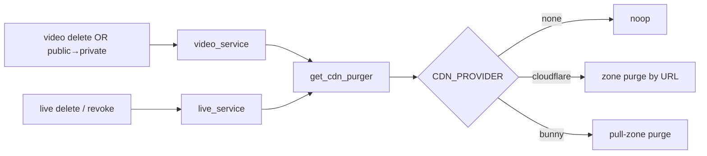
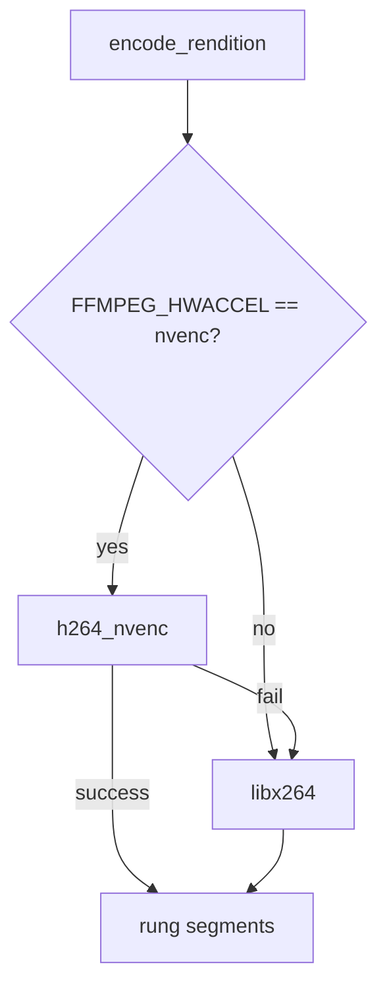
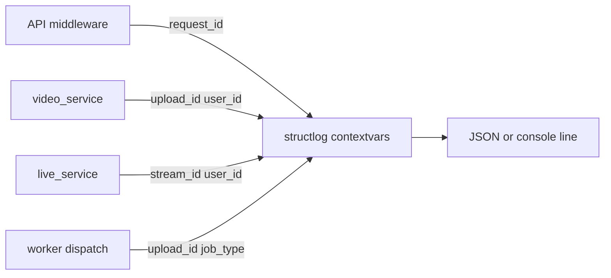

# Ops — delivery, hardware, quality, and observability

Index: [`README.md`](README.md).

This document covers operational concerns that surround encode and playback: edge cache invalidation, GPU workers, optional quality scoring, structured logging, metrics, tracing, and the HTTPS edge. It assumes the platform topology in [`FOUNDATION.md`](FOUNDATION.md) and the VOD pipeline in [`MEDIA_CORE.md`](MEDIA_CORE.md).

## CDN purge design

OnStream does not require a CDN, but production deployments often place Cloudflare or Bunny in front of `/v1/playback`. When content is revoked or hidden, playlist URLs that were previously public can remain cached at the edge. Purge adapters exist so delete and privacy transitions issue real provider HTTP calls (or a no-op when `CDN_PROVIDER=none`).



| Trigger | Module | URL purged |
|---------|--------|------------|
| Soft-delete video | `application/video_service.py` | `{PUBLIC_PLAYBACK_BASE_URL}/v1/playback/{upload_id}/master.m3u8` |
| Public → private | same | same |
| Delete live stream | `application/live_service.py` | `/v1/playback/live/{stream_id}/master.m3u8` |

| Setting | Values |
|---------|--------|
| `CDN_PROVIDER` | `none` (default), `cloudflare`, `bunny` |
| `PUBLIC_PLAYBACK_BASE_URL` | Edge origin for purge URLs; empty → `PUBLIC_API_BASE_URL` |
| `CLOUDFLARE_API_TOKEN` / `CLOUDFLARE_ZONE_ID` | Cloudflare |
| `BUNNY_API_KEY` / `BUNNY_PULL_ZONE_ID` | Bunny |

Implementation package: `src/infrastructure/cdn/` (`base.py`, `cloudflare.py`, `bunny.py`, `noop.py`, `factory.py`). Requests use `httpx` with `tenacity` retries. Continuous integration mocks HTTP; there are no stub providers that pretend to purge.

**R2 + Cloudflare.** Object storage (`STORAGE_BACKEND=r2`) and CDN purge are independent: R2 holds bytes; Cloudflare (or Bunny) caches playback HTTP. Set `PUBLIC_PLAYBACK_BASE_URL` to the hostname viewers use so purge targets match edge cache keys. Credential and addressing notes: [`PROVIDERS.md`](PROVIDERS.md). Fastly is not implemented in this pass.

**Cache headers versus purge.** When `PLAYBACK_CDN_HEADERS_ENABLED=true`, `playback_headers.py` emits short `Cache-Control` on live playlists and longer cache on VOD segments. Headers reduce stale edge behavior day to day; purge corrects revocation events.

## NVENC worker design

GPU encoding is optional. The default Compose `worker` uses CPU `libx264`. Operators who have NVIDIA hardware can run the `gpu` profile so `encode_rendition` prefers `h264_nvenc` and falls back to `libx264` if the encoder fails (missing driver, unsupported FFmpeg build, or device error).



| Piece | Detail |
|-------|--------|
| Image | `Dockerfile.gpu` |
| Compose | `docker compose --profile gpu up worker-gpu` |
| Env | `FFMPEG_HWACCEL=nvenc`, `NVIDIA_VISIBLE_DEVICES` |
| Code | `infrastructure/media/ffmpeg.py` |

Many distribution FFmpeg packages lack NVENC. Production GPU hosts should provide an NVENC-capable binary. Leaving the CPU worker as default keeps local development and CI unchanged.

## Quality gate (VMAF / PSNR)

After ABR encode, an optional gate compares the top rung to the source. The feature is disabled by default because libvmaf (and even PSNR) is CPU-expensive and would slow every upload in development.

| Setting | Default | Meaning |
|---------|---------|---------|
| `QUALITY_GATE_ENABLED` | `false` | Off in CI/dev |
| `QUALITY_GATE_STRICT` | `false` | If true, failing score fails the job |
| `QUALITY_GATE_MIN_VMAF` | `70` | Threshold (PSNR path mapped similarly in `quality.py`) |

When enabled:

- The score is stored on `videos.quality_score`.
- Scores below threshold emit webhook `video.quality` and a warning on the job message.
- With `QUALITY_GATE_STRICT=true`, the transcode job fails instead of only warning.

Implementation: `src/infrastructure/media/quality.py`, invoked from `transcode_handler`.

## Structured logging

Correlation fields are bound into structlog contextvars so every log line in a request or job can be grepped by asset identity without string-interpolating ids into messages.



Use `bind_context(...)` and `clear_context()` from `src/core/logger.py`. In `ENV=production`, output is JSON. In development, output is console-oriented.

Greppable fields include `upload_id=`, `stream_id=`, `job_type=`, `request_id=`, and `user_id=`.

## Metrics and tracing

Prometheus metrics live in `src/core/metrics.py` and are exposed at `GET /metrics` when `PROMETHEUS_ENABLED` is true. HTTP middleware records request counts and latency; live and playback paths update gauges and counters used by the provisioned Grafana dashboard.

| Metric | Intent |
|--------|--------|
| `onstream_http_requests_total` | HTTP count by method/endpoint/status |
| `onstream_http_request_duration_seconds` | Latency histogram |
| `onstream_live_streams_active` | Live gauge |
| `onstream_live_streams_stale_total` | Stale detections |
| `onstream_live_playlist_age_seconds` | Playlist freshness |
| `onstream_live_abr_active` | Live ABR processes |
| `onstream_live_auth_total` | MediaMTX auth allow/deny |
| `onstream_playback_responses_total` | Playback outcomes |
| `onstream_qoe_*` | Canary playlist age / fetch latency |

```bash
docker compose --profile obs up prometheus grafana
```

- Prometheus: http://localhost:9090 (scrapes `api:8000/metrics`)
- Grafana: http://localhost:3000 — provisioned under `deploy/grafana/provisioning/`

OpenTelemetry setup is in `src/core/otel.py` when `OTEL_ENABLED` is set (API service name `onstream-api`, worker `onstream-worker`). Optional error reporting uses `SENTRY_DSN`.

## Caddy edge (`edge` profile)

`deploy/Caddyfile` terminates TLS and reverse-proxies the API and MediaMTX WebRTC ports. Set `PUBLIC_HTTPS_BASE_URL` (and related public bases) so issued playback, WHIP, and WHEP URLs match the certificate hostname. LAN-only demos may omit Caddy; browser WHIP over the public internet should not.

## Profile cheat sheet

| Profile | Purpose |
|---------|---------|
| `ai` | AI worker image |
| `gpu` | NVENC worker |
| `turn` | coturn (+ `docker-compose.turn.yml` / MediaMTX ICE example) |
| `edge` | Caddy |
| `obs` | Prometheus + Grafana |
