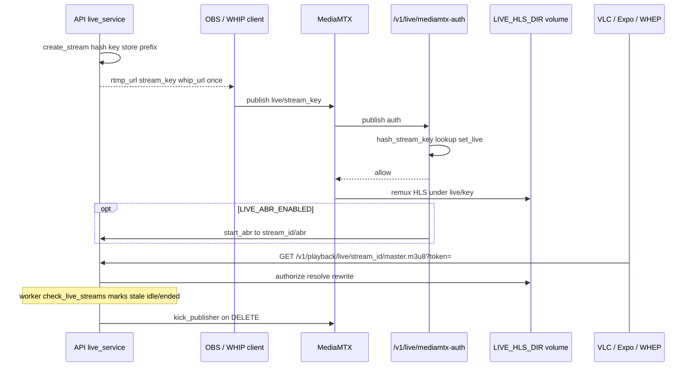

# Playback clients (VLC / OBS / WHIP / WHEP)

Index: [`README.md`](README.md).

This document explains how players and encoders attach to OnStream. VOD and live both deliver **HLS** through OnStream’s playback API. Live ingest is delegated to **MediaMTX** (RTMP and WebRTC WHIP/WHEP), while OnStream owns stream identity, publish authorization, playback URLs, health, and revoke/kick behavior.

Use the first section for live system design. The remainder provides operator recipes for VLC, OBS, WHIP/WHEP, optional edge profiles, and the Expo demo.

## Live system design

A live session begins when an authenticated user creates a stream. OnStream stores only a hashed key and returns the plaintext key (and WHIP/WHEP URLs) once. OBS or a WHIP client publishes to MediaMTX on path `live/{stream_key}`. MediaMTX asks OnStream’s auth webhook before allowing publish; on success the row becomes `live` and HLS appears on the shared live volume. Viewers never need the stream key: they play `/v1/playback/live/{stream_id}/...` with a stream token or public flag. Revoke deletes the credential, kicks the publisher, stops optional ABR, and can purge CDN URLs.



| Concern | Module |
|---------|--------|
| Create / URLs / revoke | `application/live_service.py` |
| Auth webhook | `api/v1/routes/live.py` → `authorize_publish` |
| Playback | `api/v1/routes/live_playback.py` |
| Health snapshot | `infrastructure/live/health.py` |
| Kick | `infrastructure/live/mediamtx_client.py` |
| Optional live ABR | `infrastructure/media/live_abr.py` |
| MediaMTX config | `configs/mediamtx.yml` |

**Path convention.** MediaMTX path = `live/{plaintext_stream_key}`. Auth hashes the key and looks up `stream_key_hash`. Playback uses opaque `stream_id` so publish secrets are not embedded in player URLs.

### LiveControlPlane (documented only)

Publish auth, kick, and path health are MediaMTX-specific today. A future `LiveControlPlane` interface (`authorize_publish`, `kick_publisher`, `path_state`) would let a second ingest backend plug in without rewriting `live_service`. **No alternate implementation ships in this tree** — MediaMTX remains the only control plane. See [`FOUNDATION.md`](FOUNDATION.md) and [`PROVIDERS.md`](PROVIDERS.md).

**Create response once.** `stream_key`, `whip_url`, and `whep_url` are returned only on `POST /v1/live/`. Later GET responses expose `webrtc_base` and `playback_url` without the secret key. Store the create payload securely if you need to reconnect an encoder.

### Efficiency notes (live)

1. **Default:** `LIVE_ABR_ENABLED=false` — MediaMTX remuxes one HLS ladder (inexpensive; appropriate for LAN OBS→VLC).
2. **Optional:** `LIVE_ABR_ENABLED=true` — FFmpeg realtime multi-bitrate under `{LIVE_HLS_DIR}/{stream_id}/abr` (CPU intensive).
3. Do not enable live ABR solely because VOD uses ABR; the cost models differ.

### TURN / Caddy

- LAN demonstration networks typically do not need TURN.
- Internet or NAT traversal: enable `docker compose --profile turn` and configure ICE using `configs/mediamtx.turn.example.yml`.
- Browser WHIP over HTTPS: enable `--profile edge` (Caddy) and HTTPS public base URLs — see [`OPS_MEDIA.md`](OPS_MEDIA.md).

## VOD → VLC or OBS (already available)

1. Register/login: `POST /v1/auth/register`, `POST /v1/auth/login`.
2. Upload a video: `POST /v1/videos/` (multipart) or direct upload flow under `/v1/uploads`.
3. Wait until status is `READY` (job via worker).
4. Create a playback token:

```bash
curl -s -X POST "http://localhost:8000/v1/videos/{video_id}/tokens" \
  -H "Authorization: Bearer ACCESS_TOKEN" \
  -H "Content-Type: application/json" \
  -d '{"type":"playback"}'
```

5. Open the returned `playback_url` in:
   - **VLC:** Media → Open Network Stream → paste URL (includes `?token=...`).
   - **OBS:** Sources → Media Source → Local File unchecked → input the same HLS URL.

Public videos (`is_public=true`) can omit the token for VLC.

Example URL shape:

```text
http://localhost:8000/v1/playback/{video_id}/master.m3u8?token=...
```

## Live: OBS → MediaMTX → VLC

Requires Docker Compose with the `mediamtx` service (`docker compose up`).

### 1. Create a live stream

```bash
curl -s -X POST "http://localhost:8000/v1/live/" \
  -H "Authorization: Bearer ACCESS_TOKEN" \
  -H "Content-Type: application/json" \
  -d '{"title":"My live","is_public":false}'
```

Response includes (stream key and WHIP/WHEP shown **once**):

- `rtmp_url` — OBS server URL (e.g. `rtmp://localhost:1935/live`)
- `stream_key` — OBS stream key
- `whip_url` / `whep_url` — WebRTC publish / play (path `live/{stream_key}`)
- `webrtc_base` — MediaMTX WebRTC base (also returned on later GET)
- `playback_url` — HLS URL for VLC (may need a token if private)

**Important:** Full `whip_url` / `whep_url` (with stream key) are only returned on create. Later GET responses omit them; store the create payload securely.

### 2. Configure OBS (RTMP)

- Settings → Stream → Service: **Custom**
- Server: value of `rtmp_url` (typically `rtmp://localhost:1935/live`)
- Stream Key: value of `stream_key`
- Start Streaming

MediaMTX authenticates publish via `POST /v1/live/mediamtx-auth`.

### 3. WHIP / WHEP (WebRTC)

MediaMTX WebRTC listens on `PUBLIC_WEBRTC_BASE_URL` (default `http://localhost:8889`).

| Use | URL shape |
|-----|-----------|
| Publish (WHIP) | `{PUBLIC_WEBRTC_BASE_URL}/live/{stream_key}/whip` |
| Play (WHEP) | `{PUBLIC_WEBRTC_BASE_URL}/live/{stream_key}/whep` |

Path remains `live/{plaintext_stream_key}` (same auth as RTMP). Use a WHIP-capable encoder (OBS WHIP plugin, browser WHIP client, etc.).

### 4. Watch in VLC

Private streams — issue a token:

```bash
curl -s -X POST "http://localhost:8000/v1/live/{stream_id}/tokens" \
  -H "Authorization: Bearer ACCESS_TOKEN" \
  -H "Content-Type: application/json" \
  -d '{}'
```

Open `playback_url` in VLC (Network stream).

```text
http://localhost:8000/v1/playback/live/{stream_id}/master.m3u8?token=...
```

### 5. Stop / revoke

```bash
curl -s -X DELETE "http://localhost:8000/v1/live/{stream_id}" \
  -H "Authorization: Bearer ACCESS_TOKEN"
```

Revoking ends the stream key; further OBS/WHIP publish fails auth; playback eventually 404s when HLS is gone.

## Demo HTML player

Set `DEMO_PLAYER_ENABLED=true` and open `http://localhost:8000/demo/` (hls.js). Paste a public or tokenized master playlist URL.

## Caddy edge (profile `edge`)

```bash
docker compose --profile edge up caddy
```

`deploy/Caddyfile` reverse-proxies the API and MediaMTX WebRTC. Set `PUBLIC_HTTPS_BASE_URL` when terminating TLS in front of the stack.

## TURN / coturn (profile `turn`)

For WebRTC behind NAT:

```bash
docker compose --profile turn -f docker-compose.yml -f docker-compose.turn.yml up
```

Then configure MediaMTX ICE servers. See `configs/mediamtx.turn.example.yml` and merge `webrtcICEServers2` into `configs/mediamtx.yml` (or mount an overlay). Default example credentials: `onstream` / `onstreamturn`.

Env hints when using TURN: `MEDIAMTX_TURN_URL`, matching coturn user/pass, and the example ICE snippet.

## Ports (Compose)

| Port | Service |
|------|---------|
| 8000 | OnStream API + playback proxy |
| 1935 | MediaMTX RTMP (OBS) |
| 8888 | MediaMTX HLS (internal / debug; prefer OnStream `/v1/playback/live/...`) |
| 8889 | MediaMTX WebRTC (WHIP/WHEP) |
| 8189/udp | MediaMTX WebRTC ICE/UDP |
| 80/443 | Caddy (`edge` profile) |
| 3478 | coturn (`turn` profile) |

## Env kill switches

```
LIVE_ENABLED=true
LIVE_ABR_ENABLED=false
LIVE_ABR_LADDER=360:800,720:2500,1080:5000
PUBLIC_RTMP_BASE_URL=rtmp://localhost:1935/live
PUBLIC_WEBRTC_BASE_URL=http://localhost:8889
PUBLIC_HTTPS_BASE_URL=
LIVE_HLS_DIR=data/live
LIVE_HEALTH_ENABLED=true
LIVE_STALE_SECONDS=20
PLAYBACK_CDN_HEADERS_ENABLED=true
DEMO_PLAYER_ENABLED=false
```

## CDN / edge cache headers

When `PLAYBACK_CDN_HEADERS_ENABLED=true`, playback responses set `Cache-Control`:

| Asset | VOD | Live |
|-------|-----|------|
| `.m3u8` | `max-age=3` | `no-cache` / `no-store` |
| `.ts` | long `immutable` | `max-age=2` |

Owner health: `GET /v1/live/{stream_id}/health` (stale playlist age, ABR status).

## Mobile demo (Expo Go)

Lab app under [`onstream-demo/`](../onstream-demo/) (Expo SDK **54** for Expo Go on physical phones; SDK 57 needs a dev build during the transition).

```bash
cd onstream-demo
npm install
npm start
```

Set API base to `http://<LAN-IP>:8000` in the app (phones cannot use `localhost` for your PC). Covers auth, VOD upload, signed HLS (`expo-video`), live create (copy RTMP/WHIP/WHEP once), health, and revoke. See [`onstream-demo/README.md`](../onstream-demo/README.md).
