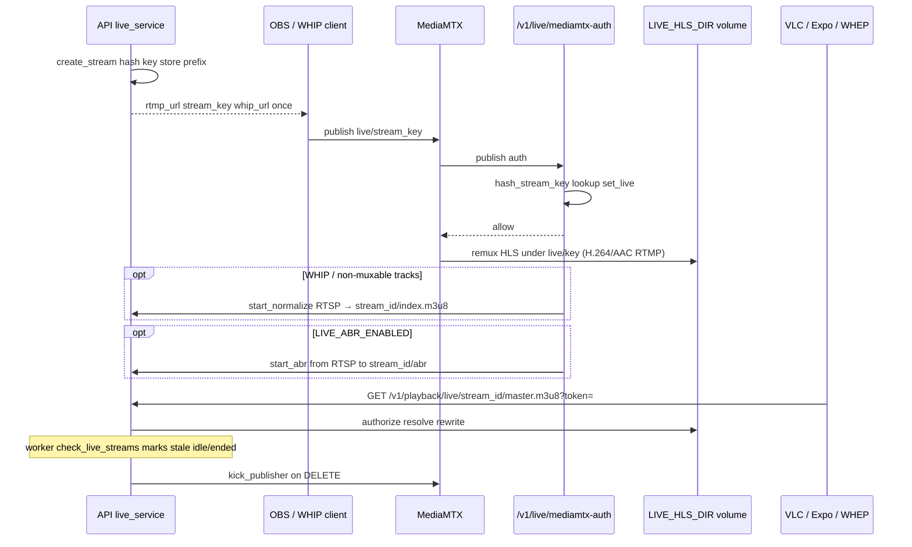

# Playback clients (VLC / OBS / WHIP / WHEP)

Index: [`README.md`](README.md).

This document explains how players and encoders attach to OnStream. VOD and live both deliver **HLS** through OnStream’s playback API. Live ingest is delegated to **MediaMTX** (RTMP and WebRTC WHIP/WHEP), while OnStream owns stream identity, publish authorization, playback URLs, health, and revoke/kick behavior.

Use the first section for live system design. The remainder provides operator recipes for VLC, OBS, WHIP/WHEP, optional edge profiles, and the Expo demo.

## Live system design

A live session begins when an authenticated user creates a stream. OnStream stores only a hashed key and returns the plaintext key (and WHIP/WHEP URLs) once. OBS or a WHIP client publishes to MediaMTX on path `live/{stream_key}`. MediaMTX asks OnStream’s auth webhook before allowing publish; on success the row becomes `live`. Playback HLS is always H.264 + AAC: RTMP that is already muxable is remuxed by MediaMTX; WHIP (typically VP8 + Opus) is normalized once by FFmpeg from MediaMTX RTSP into `{LIVE_HLS_DIR}/{stream_id}/`. WHEP stays on the raw ingest path. Viewers never need the stream key: they play `/v1/playback/live/{stream_id}/...` with a stream token or public flag. Revoke deletes the credential, kicks the publisher, stops normalize/ABR sidecars, and can purge CDN URLs.

Integrators can subscribe to outbound HMAC webhooks for the same lifecycle: `live.created` → `live.started` → (`live.idle` on disconnect/stale) → `live.ended` on revoke. See [`API.md`](API.md#live-outbound-webhooks).



| Concern | Module |
|---------|--------|
| Create / URLs / revoke | `application/live_service.py` |
| Auth webhook | `api/v1/routes/live.py` → `authorize_publish` |
| Playback | `api/v1/routes/live_playback.py` |
| Health snapshot | `infrastructure/live/health.py` |
| Kick | `infrastructure/live/mediamtx_client.py` |
| Live normalize (WHIP → H.264/AAC HLS) | `infrastructure/media/live_normalize.py` |
| Optional live ABR | `infrastructure/media/live_abr.py` |
| MediaMTX config | `configs/mediamtx.yml` |

**Path convention.** MediaMTX path = `live/{plaintext_stream_key}`. Auth hashes the key and looks up `stream_key_hash`. Playback uses opaque `stream_id` so publish secrets are not embedded in player URLs.

### LiveControlPlane (documented only)

Publish auth, kick, and path health are MediaMTX-specific today. A future `LiveControlPlane` interface (`authorize_publish`, `kick_publisher`, `path_state`) would let a second ingest backend plug in without rewriting `live_service`. **No alternate implementation ships in this tree** — MediaMTX remains the only control plane. See [`FOUNDATION.md`](FOUNDATION.md) and [`PROVIDERS.md`](PROVIDERS.md).

**Create response once.** `stream_key`, `whip_url`, and `whep_url` are returned only on `POST /v1/live/`. Later GET responses expose `webrtc_base` and `playback_url` without the secret key. Store the create payload securely if you need to reconnect an encoder.

### Efficiency notes (live)

1. **Default:** `LIVE_ABR_ENABLED=false`, `LIVE_NORMALIZE_ENABLED=true` — RTMP H.264+AAC is MediaMTX remux only (no extra CPU). Browser WHIP (VP8/Opus, or H.264+Opus) is FFmpeg RTSP → `{LIVE_HLS_DIR}/{stream_id}/index.m3u8`.
2. **Optional:** `LIVE_ABR_ENABLED=true` — FFmpeg multi-bitrate from the same RTSP URL under `{LIVE_HLS_DIR}/{stream_id}/abr` (CPU intensive; skips the single-rendition normalize sidecar).
3. Playback prefers `{stream_id}/index.m3u8` over MediaMTX `live/{key}/`, so a crashed MPEG-TS muxer (VP8/Opus) cannot win. WHEP is unchanged on the ingest path.
4. **Latency ladder (Mux / industry):** Expo Go plays **classic HLS** — `LIVE_HLS_SEGMENT_SECONDS=1` targets ~3–6s glass-to-glass (not VOD’s 4s segments). Next rung is **LL-HLS** (~2–4s, not wired yet). Sub-second is **WHEP / WebRTC**, which Expo Go cannot play natively.
5. Do not enable live ABR solely because VOD uses ABR; the cost models differ.

### TURN / Caddy

- LAN demonstration networks typically do not need TURN.
- Internet or NAT traversal: enable `docker compose --profile turn` and configure ICE using `configs/mediamtx.turn.example.yml`.
- Browser WHIP over HTTPS: enable `--profile edge` (Caddy) and HTTPS public base URLs — see [`OPS_MEDIA.md`](OPS_MEDIA.md).

## VOD → VLC or OBS (already available)

1. Register/login: `POST /v1/auth/register`, `POST /v1/auth/login`.
2. Upload a video: `POST /v1/videos/` (multipart) or direct upload flow under `/v1/uploads`.
3. Wait until status is `READY` (job via worker).
4. Create a playback token:

```bash
curl -s -X POST "http://localhost:8000/v1/videos/{video_id}/tokens" \
  -H "Authorization: Bearer ACCESS_TOKEN" \
  -H "Content-Type: application/json" \
  -d '{"type":"playback"}'
```

5. Open the returned `playback_url` in:
   - **VLC:** Media → Open Network Stream → paste URL (includes `?token=...`).
   - **OBS:** Sources → Media Source → Local File unchecked → input the same HLS URL.

Public videos (`is_public=true` or `visibility=public`) and **unlisted** videos can omit the token for VLC. Private videos need a stream token or owner JWT.

Clip shares bake `clip_start` / `clip_end` into the stream JWT. Compatible players should seek to start and stop at end; OnStream also injects `#EXT-X-START:TIME-OFFSET` on the master playlist. Storyboard scrub uses `/v1/playback/{id}/storyboard.vtt` + `storyboard.jpg` (same token as HLS).

`/demo/watch/?s=&t=` is the share landing page. Append `embed=1` for iframe chrome, `playlist={id}` when the playlist is public.

Example URL shape:

```text
http://localhost:8000/v1/playback/{video_id}/master.m3u8?token=...
```

## Live: OBS → MediaMTX → VLC

Requires Docker Compose with the `mediamtx` service (`docker compose up`).

### 1. Create a live stream

```bash
curl -s -X POST "http://localhost:8000/v1/live/" \
  -H "Authorization: Bearer ACCESS_TOKEN" \
  -H "Content-Type: application/json" \
  -d '{"title":"My live","is_public":false}'
```

Response includes (stream key and WHIP/WHEP shown **once**):

- `rtmp_url` — OBS server URL (e.g. `rtmp://localhost:1935/live`)
- `stream_key` — OBS stream key
- `whip_url` / `whep_url` — WebRTC publish / play (path `live/{stream_key}`)
- `webrtc_base` — MediaMTX WebRTC base (also returned on later GET)
- `playback_url` — HLS URL for VLC (may need a token if private)

**Important:** Full `whip_url` / `whep_url` (with stream key) are only returned on create. Later GET responses omit them; store the create payload securely.

### 2. Configure OBS (RTMP)

- Settings → Stream → Service: **Custom**
- Server: value of `rtmp_url` (typically `rtmp://localhost:1935/live`)
- Stream Key: value of `stream_key`
- Start Streaming

MediaMTX authenticates publish via `POST /v1/live/mediamtx-auth`.

### 3. WHIP / WHEP (WebRTC)

MediaMTX WebRTC listens on `PUBLIC_WEBRTC_BASE_URL` (default `http://localhost:8889`).

| Use | URL shape |
|-----|-----------|
| Publish (WHIP, encoder) | `{PUBLIC_WEBRTC_BASE_URL}/live/{stream_key}/whip` (create-once) |
| Play (WHEP, encoder/debug) | `{PUBLIC_WEBRTC_BASE_URL}/live/{stream_key}/whep` (create-once; do not give to viewers) |
| Play (WHEP, viewers) | `POST /v1/playback/live/{stream_id}/whep?token=` then `DELETE` the `Location` session |

Path remains `live/{plaintext_stream_key}` on MediaMTX (same auth as RTMP). Use a WHIP-capable encoder (OBS WHIP plugin, browser WHIP client, etc.).

**Viewer WHEP** goes through OnStream so playback tokens apply and the stream key never appears in the player. The API talks to MediaMTX at `MEDIAMTX_WEBRTC_URL` (loopback/docker), not `PUBLIC_WEBRTC_BASE_URL` (browser/encoder). Signaling is proxied; ICE/RTP still terminates on MediaMTX (`:8889` / `:8189`). Lab player: `http://127.0.0.1:8000/demo/whep/?stream=&token=` (secure context). Expo Go keeps HLS; **Watch live (low latency)** opens the demo page.

Browser WHIP is usually VP8 + Opus, which MediaMTX’s MPEG-TS HLS muxer cannot remux. OnStream pulls the same path over RTSP and writes a GOP-aligned **EVENT** archive under `{LIVE_HLS_DIR}/{stream_id}/archive/` (H.264 + AAC). Live HLS playback serves that playlist so viewers can DVR-scrub; `#EXT-X-START` keeps new joiners at the live edge. WHEP plays the **raw ingest** (sub-second, no timeline). MPEG-TS muxer crashes on Opus are expected and irrelevant to WHEP. Lab camera: open `http://127.0.0.1:8000/demo/whip/` on the PC (LAN HTTP hides `getUserMedia`). TURN / Caddy still apply for internet WebRTC.

### 4. Watch in VLC

Private streams — issue a token:

```bash
curl -s -X POST "http://localhost:8000/v1/live/{stream_id}/tokens" \
  -H "Authorization: Bearer ACCESS_TOKEN" \
  -H "Content-Type: application/json" \
  -d '{}'
```

Open `playback_url` in VLC (Network stream). The timeline is the DVR window (full session while `LIVE_ARCHIVE_ENABLED`). Jump near the end for live edge.

```text
http://localhost:8000/v1/playback/live/{stream_id}/master.m3u8?token=...
```

`/demo/` (hls.js) keeps an infinite back-buffer so you can scrub. Expo: native timeline + **Jump to live**.

### 5. Stop / revoke

```bash
curl -s -X DELETE "http://localhost:8000/v1/live/{stream_id}" \
  -H "Authorization: Bearer ACCESS_TOKEN"
```

Revoking ends the stream key; further OBS/WHIP publish fails auth; live playback 404s.

If `LIVE_ARCHIVE_ENABLED` (default on), revoke also promotes the archive HLS (kept for the whole session, not the sliding live window) into a READY VOD. Unpublish / OBS reconnect does not close the archive; `#EXT-X-ENDLIST` is written only on revoke. The live GET then includes `archived_upload_id` and `archive_playback_url`. Play that through `/v1/playback/{upload_id}/` like any other video (share, playlists, `/demo/watch`). Expo: ended stream → **Watch replay**.

`alembic upgrade head` through `j0a1b2c3d4e5` is required.

## Demo HTML player

Set `DEMO_PLAYER_ENABLED=true` and open `http://localhost:8000/demo/` (hls.js). Paste a public or tokenized master playlist URL.

## Caddy edge (profile `edge`)

```bash
docker compose --profile edge up caddy
```

`deploy/Caddyfile` reverse-proxies the API and MediaMTX WebRTC. Set `PUBLIC_HTTPS_BASE_URL` when terminating TLS in front of the stack.

## TURN / coturn (profile `turn`)

For WebRTC behind NAT:

```bash
docker compose --profile turn -f docker-compose.yml -f docker-compose.turn.yml up
```

Then configure MediaMTX ICE servers. See `configs/mediamtx.turn.example.yml` and merge `webrtcICEServers2` into `configs/mediamtx.yml` (or mount an overlay). Default example credentials: `onstream` / `onstreamturn`.

Env hints when using TURN: `MEDIAMTX_TURN_URL`, matching coturn user/pass, and the example ICE snippet.

## Ports (Compose)

| Port | Service |
|------|---------|
| 8000 | OnStream API + playback proxy |
| 1935 | MediaMTX RTMP (OBS) |
| 8554 | MediaMTX RTSP (FFmpeg normalize / ABR pull) |
| 8888 | MediaMTX HLS (internal / debug; prefer OnStream `/v1/playback/live/...`) |
| 8889 | MediaMTX WebRTC (WHIP/WHEP) |
| 8189/udp | MediaMTX WebRTC ICE/UDP |
| 80/443 | Caddy (`edge` profile) |
| 3478 | coturn (`turn` profile) |

## Env kill switches

```
LIVE_ENABLED=true
LIVE_ABR_ENABLED=false
LIVE_ABR_LADDER=360:800,720:2500,1080:5000
LIVE_NORMALIZE_ENABLED=true
LIVE_HLS_SEGMENT_SECONDS=1
MEDIAMTX_RTSP_URL=rtsp://127.0.0.1:8554
PUBLIC_RTMP_BASE_URL=rtmp://localhost:1935/live
PUBLIC_WEBRTC_BASE_URL=http://localhost:8889
PUBLIC_HTTPS_BASE_URL=
LIVE_HLS_DIR=data/live
LIVE_HEALTH_ENABLED=true
LIVE_STALE_SECONDS=20
PLAYBACK_CDN_HEADERS_ENABLED=true
DEMO_PLAYER_ENABLED=false
```

## CDN / edge cache headers

When `PLAYBACK_CDN_HEADERS_ENABLED=true`, playback responses set `Cache-Control` plus `X-Content-Type-Options: nosniff`:

| Asset | VOD | Live |
|-------|-----|------|
| `.m3u8` | `max-age=5, must-revalidate` | `max-age=0, s-maxage=1, must-revalidate` |
| `.ts` | long `immutable` | `max-age=4` |
| `.vtt` / thumbs | `max-age=86400` | `no-store` |

Live playlists intentionally **do not** use `no-store`: browsers revalidate every request (`max-age=0`) while a shared edge may keep the object ~1s. Revoke still relies on OnStream auth 404 + optional CDN purge. Implementation: `src/application/playback_headers.py`.

Owner health: `GET /v1/live/{stream_id}/health` (stale playlist age, `abr_running`, `normalize_running`).

## Mobile demo (Expo Go)

Lab app under [`onstream-demo/`](../onstream-demo/) (Expo SDK **54** for Expo Go on physical phones; SDK 57 needs a dev build during the transition).

```bash
cd onstream-demo
npm install
npm start
```

Set API base to `http://<LAN-IP>:8000` in the app (phones cannot use `localhost` for your PC). Covers auth, VOD upload, signed HLS (`expo-video`), live create (copy RTMP/WHIP/WHEP once), health, and revoke. See [`onstream-demo/README.md`](../onstream-demo/README.md).
