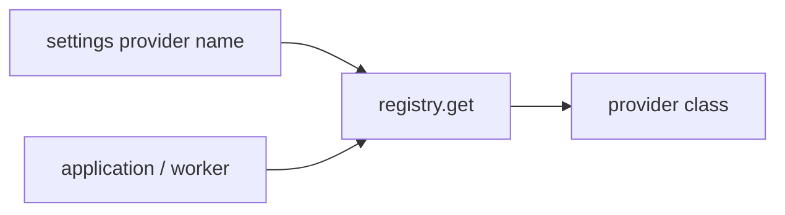

# Provider registries

Index: [`README.md`](README.md).

OnStream selects object storage, AI, email, and CDN implementations by **name** from environment settings. Application and worker code call `get_*()` factories; vendors plug in behind a shared protocol. This page is the operator map; deeper storage topology remains in [`FOUNDATION.md`](FOUNDATION.md), AI job graph in [`AI_MEDIA.md`](AI_MEDIA.md), and CDN purge in [`OPS_MEDIA.md`](OPS_MEDIA.md).



## Convention

```text
src/infrastructure/<domain>/
  base.py              # ABC / Protocol
  registry.py          # name → factory
  providers/…          # or sibling modules
  factory.py           # optional get_*() singleton (storage, CDN)
```

| Domain | Package | Setting | Names |
|--------|---------|---------|-------|
| Object storage | `infrastructure/storage/` | `STORAGE_BACKEND` | `local`, `s3`, `minio`, `r2` |
| CDN purge | `infrastructure/cdn/` | `CDN_PROVIDER` | `none`, `cloudflare`, `bunny` |
| Captions | `infrastructure/ai/captions/` | `AI_CAPTIONS_PROVIDER` | `mock`, `faster_whisper` |
| Embeddings | `infrastructure/ai/embeddings/` | `AI_EMBEDDINGS_PROVIDER` | `mock`, `sentence_transformers` |
| Moderation | `infrastructure/ai/moderation/` | `AI_MODERATION_PROVIDER` | `heuristic` |
| Email | `infrastructure/email/` | `EMAIL_PROVIDER` | `none`, `log`, `smtp` |

Unknown storage / email / CDN names fail at settings validation or registry construction. Unknown AI names **fail closed in production**; in non-production they fall back to `mock` (or `heuristic` for moderation) so local misconfig does not brick the worker.

## Storage (`local` / `s3` / `minio` / `r2`)

| Backend | Implementation | Notes |
|---------|----------------|-------|
| `local` | `LocalStorage` | Project-relative paths under `data/` |
| `s3` | `S3Storage` | Empty `S3_ENDPOINT_URL` → AWS; set endpoint for custom |
| `minio` | `S3Storage` | Path-style default; Compose endpoint `http://minio:9000` |
| `r2` | `R2Storage` | Requires `S3_ENDPOINT_URL`; region default `auto`; path-style default |

| Setting | Purpose |
|---------|---------|
| `S3_ENDPOINT_URL` | Custom S3 API (MinIO / R2) |
| `S3_ACCESS_KEY` / `S3_SECRET_KEY` / `S3_BUCKET` | Credentials |
| `S3_REGION` | AWS region; R2 uses `auto` when unset appropriately |
| `S3_ADDRESSING_STYLE` | `path` \| `virtual` (empty → registry defaults per backend) |
| `PUBLIC_API_BASE_URL` | API / stream-token host |
| `PUBLIC_PLAYBACK_BASE_URL` | Edge host for purge URL construction (falls back to API base) |

Contract tests: `tests/test_storage_contract.py`. Optional remote: `STORAGE_CONTRACT=minio|r2`.

### Cloudflare R2 recipe

1. Create an R2 bucket and S3 API token ([Cloudflare R2 boto3 docs](https://developers.cloudflare.com/r2/examples/aws/boto3/)).
2. Set:

```bash
STORAGE_BACKEND=r2
S3_ENDPOINT_URL=https://<account_id>.r2.cloudflarestorage.com
S3_ACCESS_KEY=...
S3_SECRET_KEY=...
S3_BUCKET=onstream
# Optional; empty / us-east-1 / auto all resolve to region=auto
S3_REGION=auto
# optional; path is default for r2 (matches R2 path-style URL examples)
S3_ADDRESSING_STYLE=path
```

`R2Storage` forces `region_name=auto` when `S3_REGION` is empty, `auto`, or the common `us-east-1` alias documented by Cloudflare.

3. If Cloudflare sits in front of `/v1/playback`, set `PUBLIC_PLAYBACK_BASE_URL` to the public edge origin used in player URLs (often different from the API host). Pair with `CDN_PROVIDER=cloudflare` so revoke/delete purges the same URLs viewers hit. See [`OPS_MEDIA.md`](OPS_MEDIA.md).

Production fail-closed: `EMAIL_PROVIDER` must be `smtp` (not `none`/`log`); `minio`/`r2` require `S3_ENDPOINT_URL`; unknown AI providers and missing Whisper/embedding packages raise instead of substituting mock.
## AI

Helpers `transcribe()` / `embed_texts()` remain the public entry points; they resolve providers via `src/infrastructure/ai/registry.py`. Moderation jobs call `get_moderation_provider().score(...)`. Default production-oriented names are `faster_whisper` and `sentence_transformers`; CI should use `mock`.

## Email

| Provider | Behavior |
|----------|----------|
| `none` | No-op |
| `log` | structlog the message (default in development) |
| `smtp` | stdlib `smtplib` with `SMTP_HOST` / `PORT` / `USER` / `PASSWORD` / `FROM` / `USE_TLS` |

Password reset always invokes the sender when the user exists (anti-enumeration response shape unchanged). Non-production may still return `reset_token` in the API body for local testing.

## Live control plane (documented seam only)

A future `LiveControlPlane` would abstract `authorize_publish`, `kick_publisher`, and path/health inputs. **Today MediaMTX is the sole implementation** (HTTP API + auth webhook). Do not add nginx-rtmp / alternate SFU backends until a second product need appears. See [`FOUNDATION.md`](FOUNDATION.md) and [`PLAYBACK_CLIENTS.md`](PLAYBACK_CLIENTS.md).

## Adding a vendor

1. Implement the domain ABC in a new module.
2. Register the name in that domain’s `registry.py` (and settings validator allow-list).
3. Document the name in this table and `.env.example`.
4. Add a unit test that resolves the name; mock network I/O for CI.

Background jobs use the custom Redis queue only — there is no Celery broker setting.
