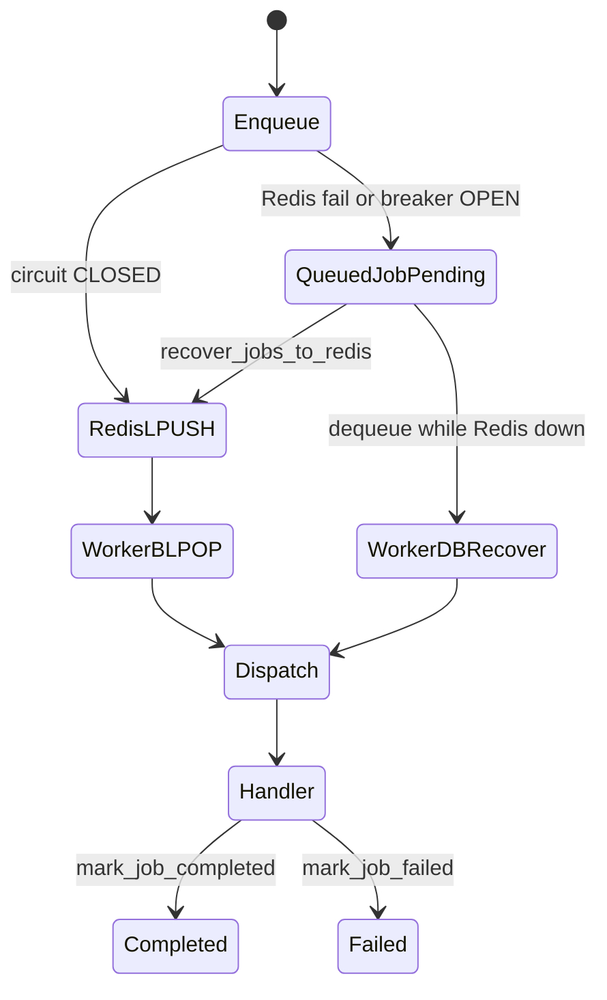
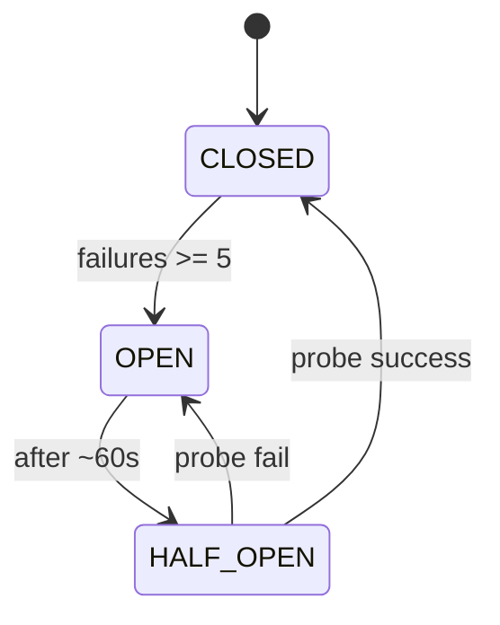
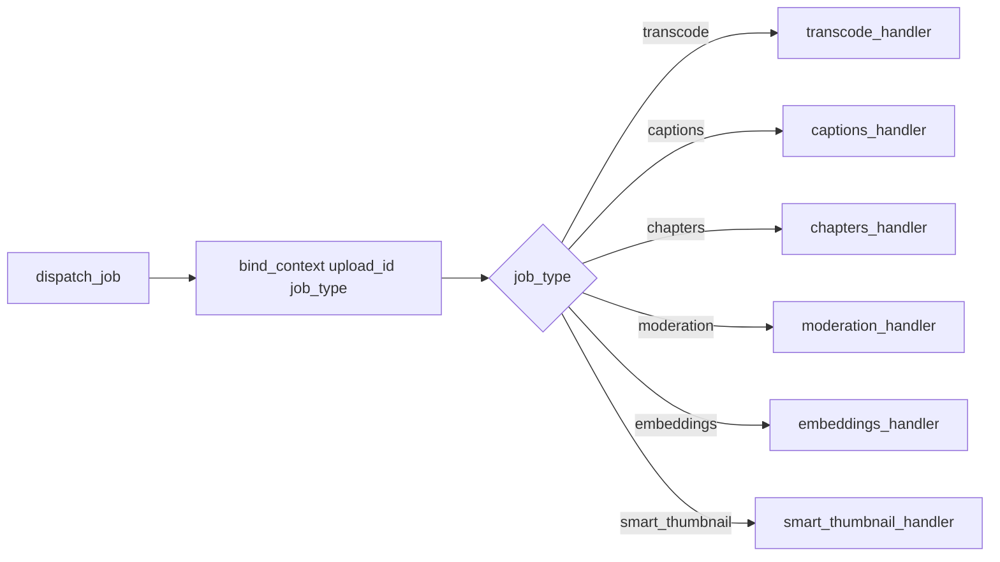

# Redis job queue — system design

Index: [`README.md`](README.md).

OnStream processes media asynchronously through a **custom Redis list queue** with a **database fallback**. The project intentionally does not use Celery, Dramatiq, or Arq: job typing, retries, and recovery stay in-repo beside the worker that already owns FFmpeg and live health.

| Module | Role |
|--------|------|
| `src/infrastructure/queue/job_queue.py` | Enqueue / dequeue / recover API |
| `src/infrastructure/queue/redis_client.py` | Pool, retries, circuit breaker |
| `src/worker/runner.py` | Loop, dispatch map, live health ticks |
| `src/infrastructure/db/models/job.py` | `VideoJob` (progress) + `QueuedJob` (fallback rows) |

## Design rationale

Redis gives low-latency handoff from API to worker. Postgres (or SQLite in local mode) remains the system of record for “this upload still needs work” when Redis is unreachable. Typed JSON payloads (`job_type`) allow one worker binary to run transcode and optional AI handlers, including GPU and AI Compose profiles, without introducing a second broker framework.

## Data path

Enqueue prefers Redis while the circuit breaker is closed. On Redis failure or an open breaker, the job is inserted into `queued_jobs`. Workers consume via `BLPOP` when Redis is healthy, or recover pending database rows when it is not. After Redis returns, pending fallback rows are re-pushed in batches.



### Redis operations

| Op | Key | Notes |
|----|-----|-------|
| Enqueue | `LPUSH video_jobs_queue` | JSON `{"upload_id","job_type"}` |
| Dequeue | `BLPOP video_jobs_queue` | Blocking pop in worker |
| Depth | `LLEN video_jobs_queue` | Health / stats |

Legacy payloads that are a bare `upload_id` string are treated as `job_type=transcode` for backward compatibility.

### Circuit breaker (`redis_client.CircuitBreaker`)

The breaker prevents the API and worker from blocking on a dead Redis. After repeated connection or timeout failures, the breaker opens, fail-fast exceptions trigger database fallback, and a later probe restores normal Redis use.



- Retries: up to three attempts with exponential backoff on connection and timeout errors.
- When OPEN: enqueue and dequeue skip Redis and use `queued_jobs`.

### Database fallback (`queued_jobs`)

`QueuedJob` rows are transport records. They are not the same as `VideoJob`, which stores user-visible transcode progress (`stage`, `progress`, `message`).

| Column idea | Use |
|-------------|-----|
| `queue_name` | `video_jobs_queue` |
| `payload` / upload + `job_type` | work identity |
| `status` | `pending` → `processing` → `completed` / `failed` / `recovered` |
| `retry_count` | capped (recovery batch skips hot failures) |

On Redis recovery, `recover_jobs_to_redis` re-`LPUSH`es a batch (default up to 100) and marks rows `recovered`.

## Worker dispatch

Each dequeued payload is bound into logging context, then routed by `job_type` through `_HANDLERS` in `src/worker/runner.py`.



### Side loops on the worker

The worker is also a lightweight live supervisor. Every few dequeue cycles it runs `check_live_streams` (stale or missing playlists → idle/ended and webhooks) and may run QoE canary fetches. That keeps live freshness logic next to the process that already holds long-running capacity, without a separate cron service for the default stack.

## Who enqueues what

| Producer | Typical `job_type` |
|----------|-------------------|
| Upload complete / multipart video create | `transcode` |
| Transcode success + `AI_ENABLED` | `moderation`, `smart_thumbnail`, `captions` |
| Captions success | `chapters`, `embeddings` |

## Configuration

| Variable | Role |
|----------|------|
| `REDIS_URL` | e.g. `redis://redis:6379/1` in Compose |
| Pool / timeout | see `redis_client` + settings |

```bash
export REDIS_URL=redis://localhost:6379/1
python start_worker.py
```

Compose includes Redis on the default stack; no profile is required for basic queuing.

## Failure modes (operator view)

| Symptom | Likely layer | What to check |
|---------|--------------|---------------|
| Uploads succeed, never READY | Worker down or stuck | `docker compose logs worker`; `LLEN` / `queued_jobs` |
| Jobs pile in DB only | Redis / breaker open | Redis health, circuit logs |
| Job `error` with FFmpeg text | Transcode | `VideoJob.message`, GPU/NVENC fallback |
| Live ends unexpectedly | Health tick | `LIVE_STALE_SECONDS`, playlist age metrics |

## Related

- VOD pipeline: [`MEDIA_CORE.md`](MEDIA_CORE.md)
- AI graph: [`AI_MEDIA.md`](AI_MEDIA.md)
- Metrics: [`OPS_MEDIA.md`](OPS_MEDIA.md)
