# Database Schema & Models Documentation

This document provides a comprehensive overview of the OnStream video streaming platform's database schema and Pydantic models, including entity relationships and data structures.

## 📊 Database Schema Overview

### Entity Relationship Diagram (ERD)

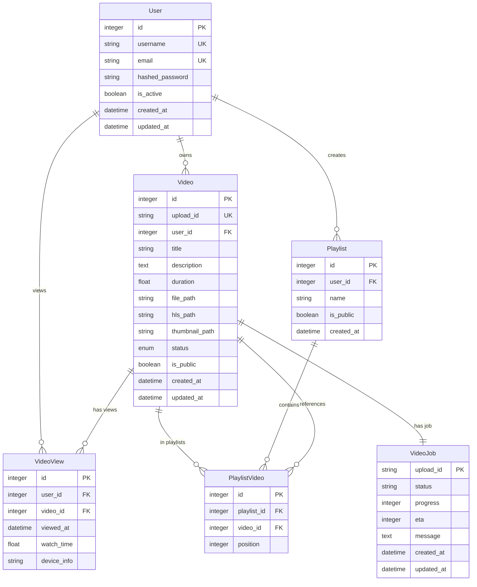

## 🏗️ Database Tables

### Users Table

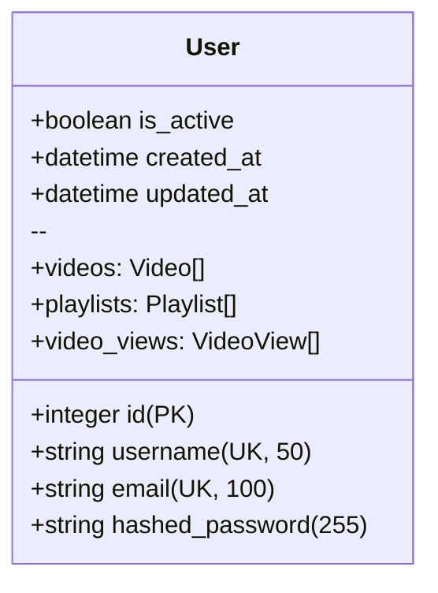

**Relationships:**

- One-to-many with Video (owns videos)
- One-to-many with Playlist (creates playlists)
- One-to-many with VideoView (views videos)

### Videos Table

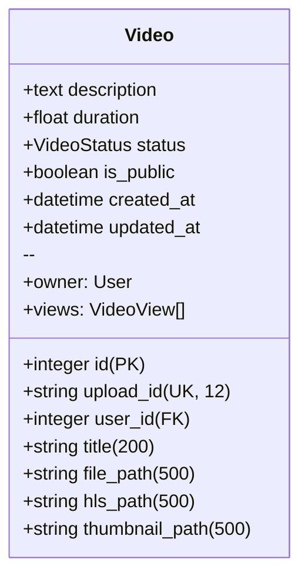

**Relationships:**

- Many-to-one with User (belongs to owner)
- One-to-many with VideoView (has views)
- One-to-one with VideoJob (processing job)
- Many-to-many with Playlist (through PlaylistVideo)

### Video Jobs Table

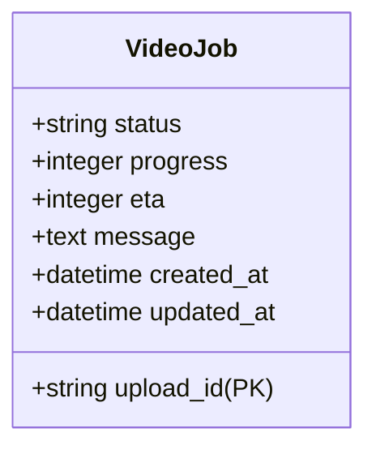

**Purpose:** Tracks background video processing jobs with progress and status.

### Video Views Table (Analytics)

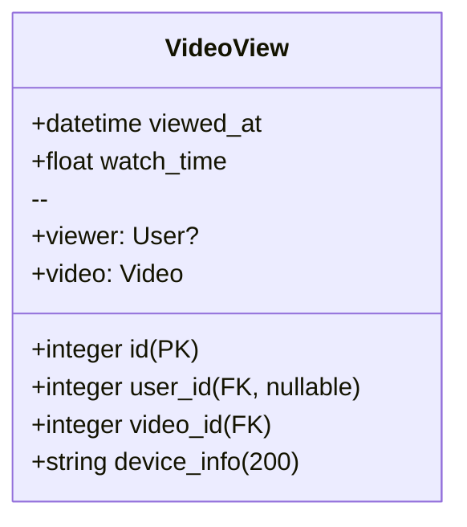

**Purpose:** Analytics table for tracking video views and watch time.

### Playlists Table

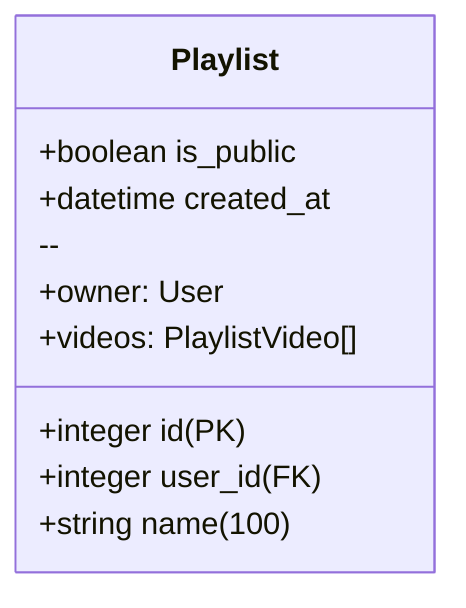

**Relationships:**

- Many-to-one with User (belongs to creator)
- One-to-many with PlaylistVideo (contains videos)

### Playlist Videos Table (Junction)

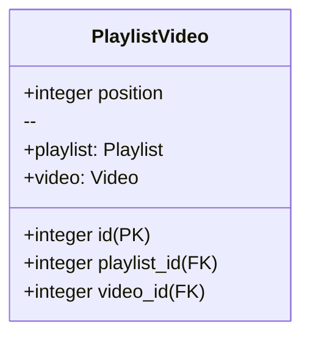

**Purpose:** Junction table for many-to-many relationship between Playlists and Videos, with ordering support.

## 📋 Pydantic Models

### Authentication Models

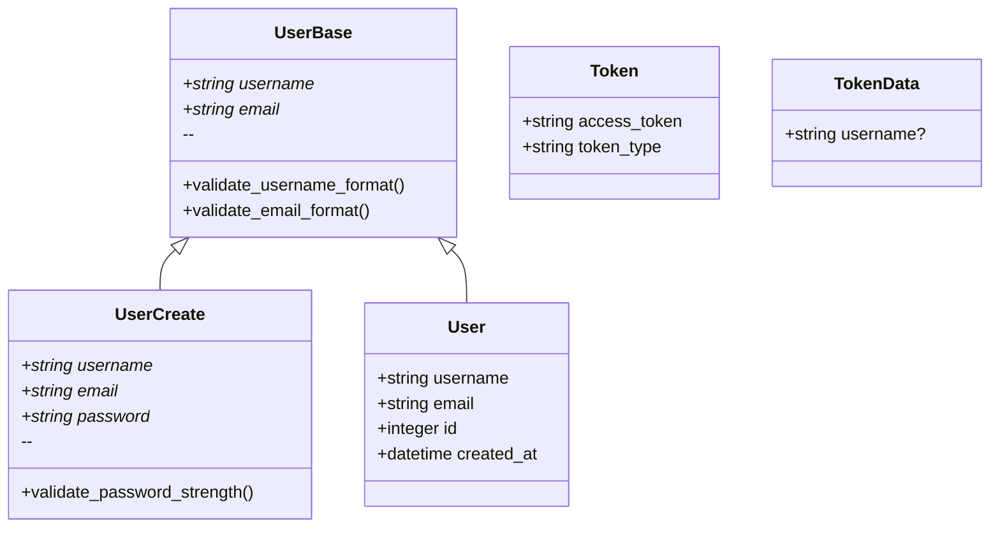

### Video Models

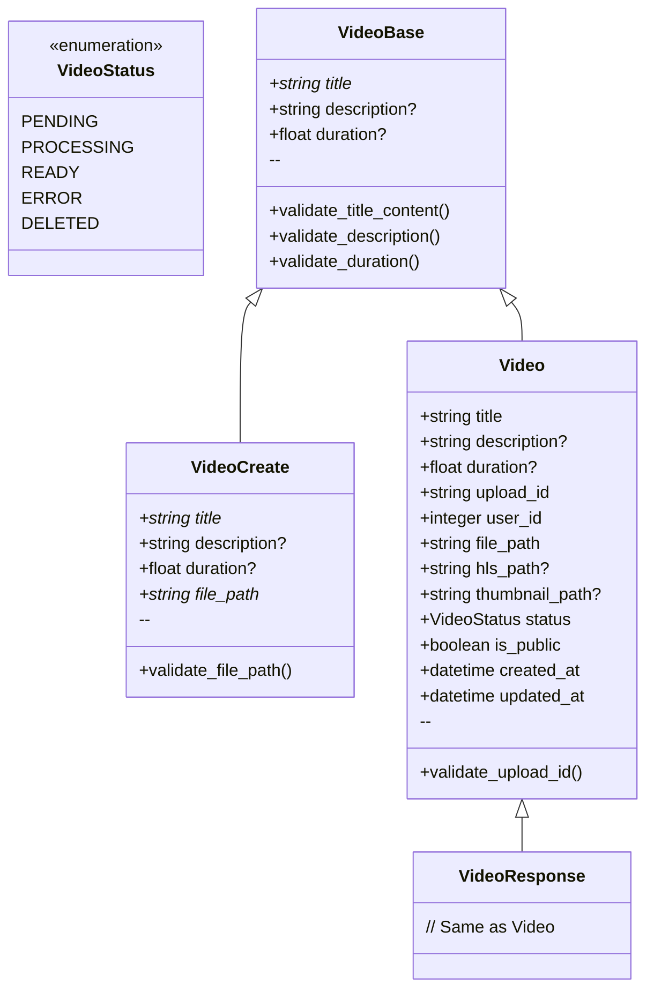

### Job Processing Models

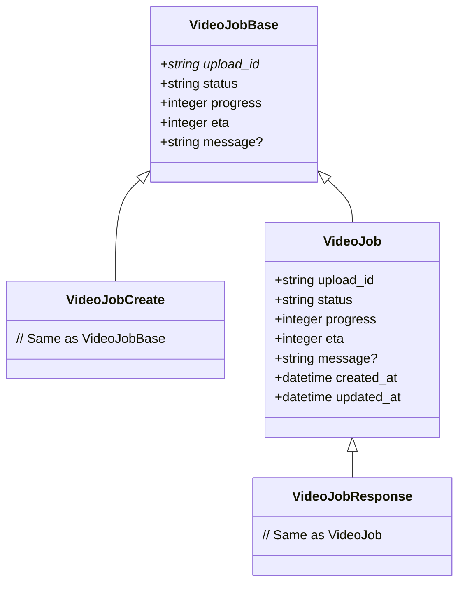

### Playlist Models

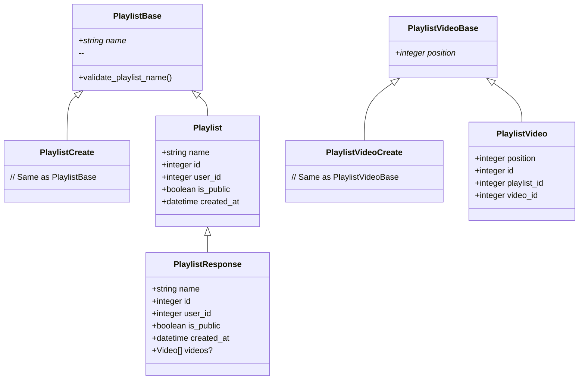

## 🔄 Data Flow & Relationships

### Video Upload & Processing Flow

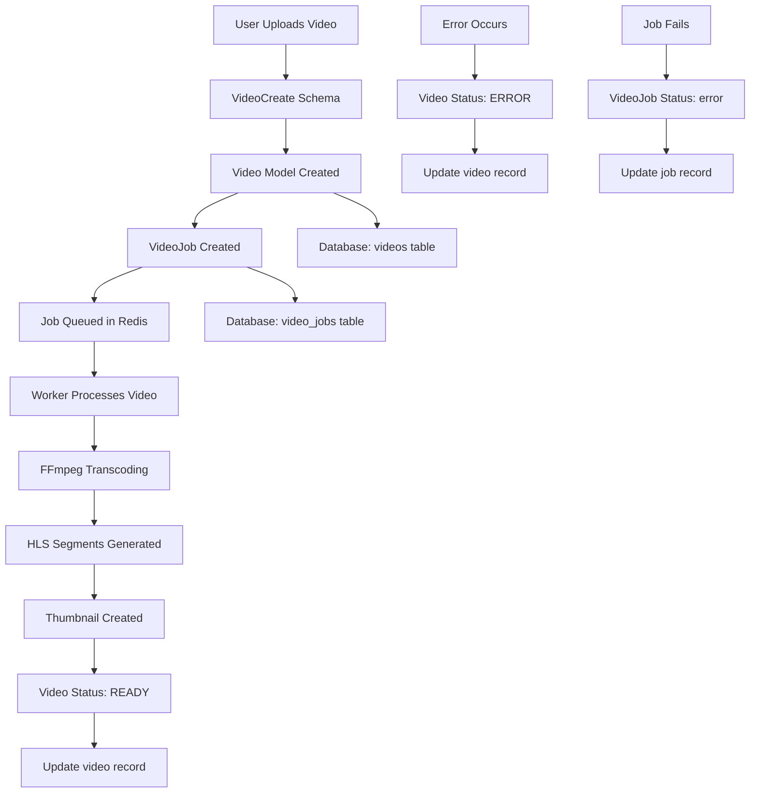

### User Authentication Flow

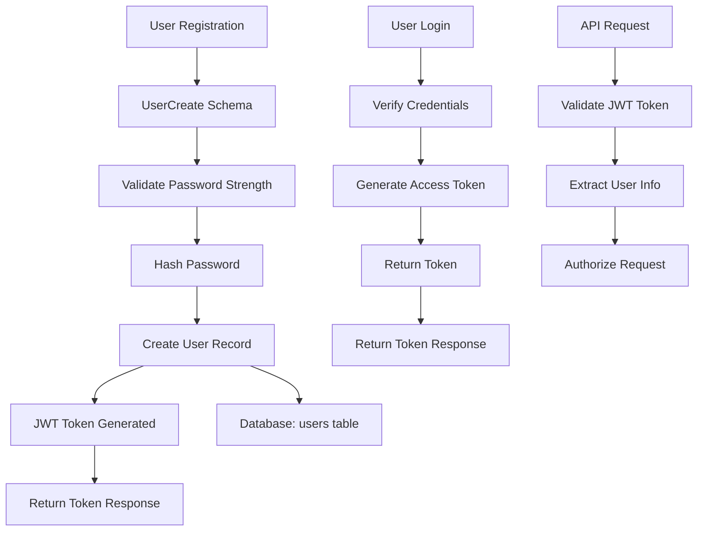

## 📏 Field Constraints & Validation

### String Length Limits

| Model | Field | Min | Max | Notes |
|-------|-------|-----|-----|-------|
| User | username | 4 | 50 | Alphanumeric + _ - |
| User | email | 5 | 100 | Email format |
| User | password | 8 | - | Strength requirements |
| Video | title | 2 | 200 | XSS prevention |
| Video | description | - | 2000 | XSS prevention |
| Video | upload_id | 8 | 12 | Alphanumeric |
| Playlist | name | 1 | 100 | XSS prevention |

### Numeric Constraints

| Model | Field | Min | Max | Type | Notes |
|-------|-------|-----|-----|------|-------|
| Video | duration | 0 | 43200 | Float | Seconds (max 12 hours) |
| VideoJob | progress | 0 | 100 | Integer | Percentage |
| PlaylistVideo | position | 0 | - | Integer | Ordering in playlist |

### Validation Rules

#### Username Validation

- Only letters, numbers, underscores, hyphens
- Cannot start/end with underscore or hyphen
- No consecutive underscores or hyphens

#### Password Validation

- Minimum 8 characters
- At least one uppercase letter
- At least one lowercase letter
- At least one number
- At least one special character

#### Email Validation

- Standard email format regex
- Must contain @ and domain

#### Video Title/Description

- XSS prevention (script tag removal)
- Title cannot be just whitespace
- Description converts empty strings to null

#### File Path Validation

- Prevents directory traversal (..)
- Only specific video extensions allowed
- Special case for "temp" during upload

#### File Path Storage & Environment Configuration

- **Environment-Specific Configuration**: Paths are configured per environment (development/production/container)
- **Base Path**: `VIDEO_STORAGE_BASE` defaults to `"data"` (relative in dev, absolute in production)
- **Computed Properties**: `VIDEO_UPLOAD_DIR`, `VIDEO_HLS_DIR`, `VIDEO_THUMBNAIL_DIR` are computed from base path
- **Storage Format**: Full filesystem paths are stored directly (no normalization)
- **Cross-Platform**: Automatic path resolution using `pathlib.Path`
- **Container-Ready**: Supports absolute paths for Docker/Kubernetes deployments

**Configuration Variables**:

- `VIDEO_STORAGE_BASE`: Base directory for all video storage (default: `"data"`)
- `VIDEO_UPLOAD_SUBDIR`: Upload subdirectory (default: `"uploads"`)
- `VIDEO_HLS_SUBDIR`: HLS subdirectory (default: `"hls"`)
- `VIDEO_THUMBNAIL_SUBDIR`: Thumbnail subdirectory (default: `"thumbnails"`)

**Environment Behavior**:

- **Development**: Relative paths resolved to absolute from project root
- **Production**: Absolute paths (e.g., `/app/data`) for container compatibility

## 🔗 Database Indexes

### Primary Keys

- `users.id`
- `videos.id`
- `video_views.id`
- `playlists.id`
- `playlist_videos.id`
- `video_jobs.upload_id`

### Unique Constraints

- `users.username`
- `users.email`
- `videos.upload_id`
- `playlist_videos(playlist_id, video_id)` - Prevents duplicate videos in playlist

### Performance Indexes

- `users.username` - Login lookups
- `users.email` - Registration checks
- `videos.user_id` - User's videos
- `videos.status` - Status filtering
- `videos.upload_id` - Video lookups
- `video_views.video_id, viewed_at` - Analytics queries
- `playlists.user_id` - User's playlists
- `playlist_videos.playlist_id` - Playlist contents
- `playlist_videos.video_id` - Video playlist membership

## 🏷️ Enums & Constants

### VideoStatus Enum

```python
class VideoStatus(str, Enum):
    PENDING = "PENDING"      # Initial state after upload
    PROCESSING = "PROCESSING"  # Worker is processing
    READY = "READY"         # Ready for streaming
    ERROR = "ERROR"         # Processing failed
    DELETED = "DELETED"     # Soft deleted
```

### Default Values

- `User.is_active = True`
- `Video.status = VideoStatus.PENDING`
- `Video.is_public = False`
- `Playlist.is_public = False`
- `VideoJob.status = "processing"`
- `VideoJob.progress = 0`
- `PlaylistVideo.position = 0`

## 🔄 Migration History

### Alembic Migrations

1. **353315e7c3a7** - Initial schema (users, videos, video_views, playlists, playlist_videos)
2. **4794218915c6** - Add upload_id to video table
3. **6688bdf12b34** - Add video_jobs table for background processing

This schema supports a complete video streaming platform with user management, video upload/processing, playlists, and analytics capabilities.
