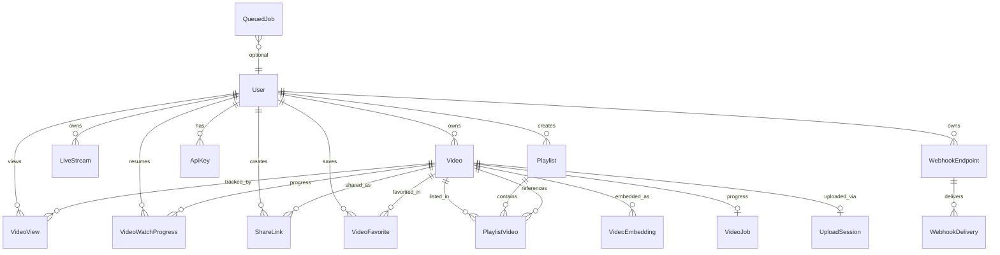
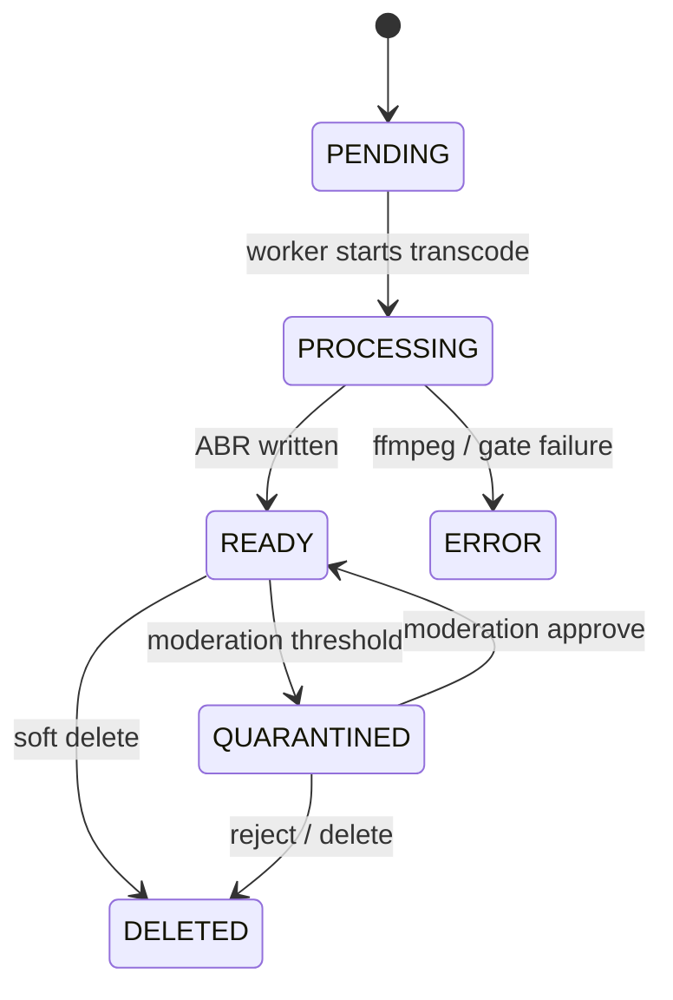
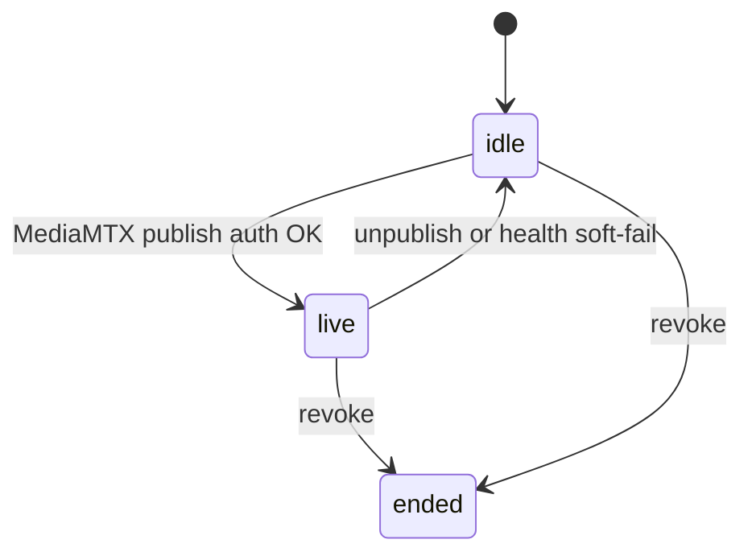

# Database schema — system map

Index: [`README.md`](README.md).

The database is the system of record for identity, media metadata, job progress, live stream credentials (hashed), webhooks, and API keys. SQLAlchemy models under `src/infrastructure/db/models/` and Alembic revisions under `alembic/versions/` are authoritative. This document explains relationships and responsibilities; it is not a generated column dump.

Schema changes must go through Alembic. API startup does not call `create_all` for production correctness.

## Entity relationship overview

Users own videos, live streams, playlists, API keys, and webhook endpoints. Videos accumulate optional AI artifacts and quality scores while remaining addressable by public `upload_id`. Queue fallback rows (`queued_jobs`) are transport state and should not be confused with `video_jobs`, which is the progress API clients poll.



## Table responsibilities

| Table | Model | Responsibility |
|-------|--------|----------------|
| `users` | `User` | Credentials, ownership root |
| `videos` | `Video` | VOD metadata; public id = `upload_id`; AI + `quality_score`; Postgres `search_vector` FTS; `visibility` (`private`/`unlisted`/`public`) with derived `is_public` |
| `video_watch_progress` | `VideoWatchProgress` | Per-user resume position / completed |
| `share_links` | `ShareLink` | Expiring share credentials (hashed token); optional `clip_start_seconds` / `clip_end_seconds` |
| `video_favorites` | `VideoFavorite` | Saved / liked videos |
| `video_jobs` | `VideoJob` | User-visible transcode progress / stages |
| `queued_jobs` | `QueuedJob` | Redis outage fallback queue rows |
| `upload_sessions` | `UploadSession` | Direct upload lifecycle |
| `live_streams` | `LiveStream` | Hashed stream keys, status, HLS paths |
| `playlists` / `playlist_videos` | `Playlist*` | Optional ordered collections |
| `video_views` | `VideoView` | Analytics stub |
| `video_embeddings` | `VideoEmbedding` | Semantic search vectors |
| `webhook_endpoints` / `webhook_deliveries` | `Webhook*` | Outbound HMAC events |
| `api_keys` | `ApiKey` | Machine auth (`X-API-Key`); hashed secret; scopes `read,upload,write,webhooks` |
| `idempotency_records` | `IdempotencyRecord` | Deduped upload/API ops |

## Video lifecycle

`VideoStatus` (`src/infrastructure/db/base.py`) tracks whether an asset is waiting, encoding, playable, failed, removed, or held for review. Quarantine is an access state layered on an already-encoded tree.



## Live lifecycle

`live_streams.status` is a string column, typically moving between idle, live, and ended. Publish success (MediaMTX auth) marks live; unpublish or stale playlist detection returns the row to idle; explicit revoke marks ended.



Outbound live webhooks follow those transitions: `live.created` (create), `live.started` (idle→live), `live.idle` (live→idle), `live.ended` (revoke only).

Secrets: only `stream_key_hash` and `stream_key_prefix` are persisted. The plaintext stream key is returned once at create time and is required for OBS/WHIP publish paths.

## Notable `videos` columns beyond classic media

| Group | Columns |
|-------|---------|
| Captions | `caption_vtt_path`, `transcript_path`, `detected_language` |
| Chapters / suggestions | `chapters_json`, `suggested_title`, `suggested_tags` |
| Moderation | `moderation_score`, `moderation_labels`, `quarantined_at` |
| Quality | `quality_score` |
| Storyboard | `storyboard_path`, `storyboard_vtt_path` |
| Visibility | `visibility`, `is_public` (derived: true only when public) |

## Migrations

```bash
alembic upgrade head
alembic revision --autogenerate -m "description"
```

## Related

- Pydantic request and response models: `src/schemas/`
- HTTP catalogue: [`API.md`](API.md)
- Queue tables versus Redis: [`REDIS_QUEUE.md`](REDIS_QUEUE.md)
